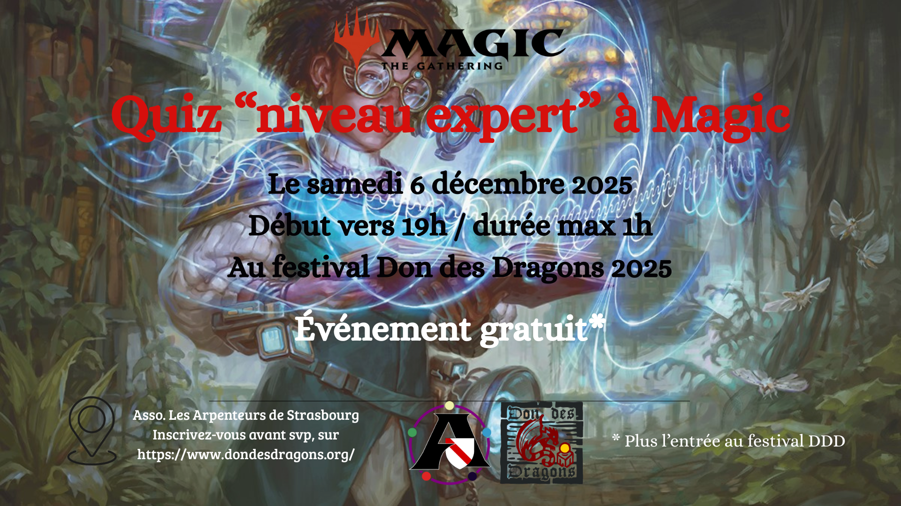
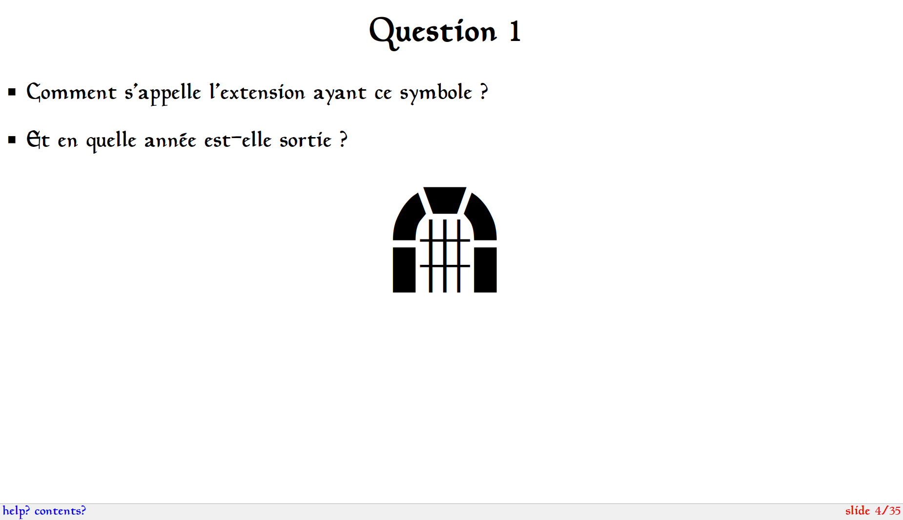
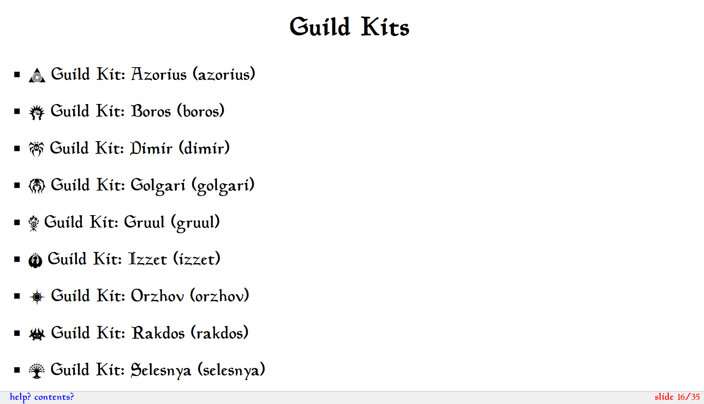
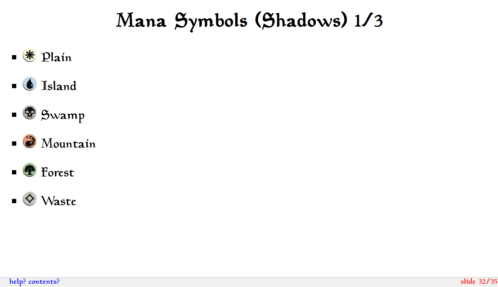
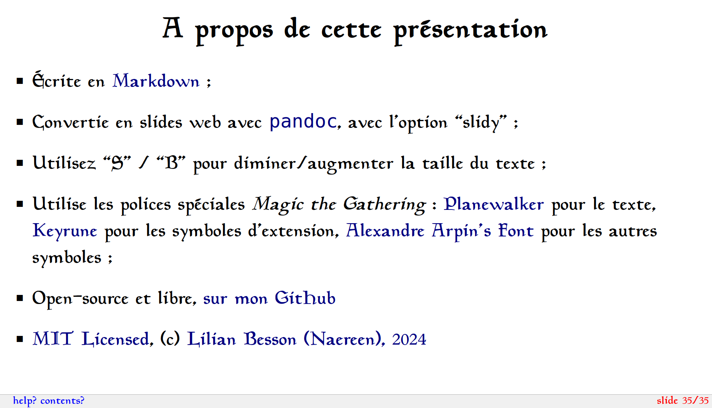

# Un quiz sur Magic the Gathering, pour le festival du Dons des Dragons édition 2024

Ce dépôt GitHub héberge le code source, ainsi que la version consultable en ligne, d'un Quiz que j'ai conçu pour la soirée du samedi 30 novembre 2024, lors du Festival du Dons des Dragons.



## Un aperçu









## Comment générer les slides ?

- Les slides sont écrits [dans ce document `slides.md`](slides.md).

- Pour recompiler les slides [en version HTML web](slides.slidy.html), utilisez la commande [`GNU Make, make slidy`](https://www.gnu.org/software/make/), qui utilise [`pandoc`](https://pandoc.org/) :
```bash
$ make slidy
```

- Pour visualiser les slides, avant de les envoyer en ligne :
```bash
$ python -m http.server
$ firefox http://localhost:8000/slides.slidy.html
```

- Ils sont aussi [ici sur naereen.github.io](https://naereen.github.io/Un-Quiz-Magic-the-Gathering-pour-le-festival-Don-des-Dragons/slides.slidy.html)

> Testé uniquement sur Ubuntu 22.04, mais devrait marcher sur d'autres Linux de la famille Debian. Probablement fonctionnel sur Windows avec WSL. Et sur Mac avec `brew` et `gnu make` installés.

----

## :scroll: License ? [](https://github.com/Naereen/Un-Quiz-Magic-the-Gathering-pour-le-festival-Don-des-Dragons/blob/master/LICENSE)
The slideshow (and all other documents) in this repository is published under the terms of the [MIT License](https://lbesson.mit-license.org/) (file [LICENSE](LICENSE)).
© [Lilian Besson](https://GitHub.com/Naereen), 2024.

The logos and images are the properties of their respective authors, mainly [Wizards of the Coast](https://magic.wizards.com/).

[](https://GitHub.com/Naereen/Un-Quiz-Magic-the-Gathering-pour-le-festival-Don-des-Dragons/graphs/commit-activity)
[](https://GitHub.com/Naereen/ama)
[](http://ForTheBadge.com)
[](https://GitHub.com/)
[](http://ForTheBadge.com)
[](http://ForTheBadge.com)
[](http://ForTheBadge.com)
