<link href="https://alexandrearpin.com/mtg-font/css/magic-font.css" rel="stylesheet" type="text/css" />
<link href="https://cdn.jsdelivr.net/npm/keyrune@latest/css/keyrune.css" rel="stylesheet" type="text/css" />

# Un Quiz sur *Magic: the Gathering*

Bienvenue dans ce quiz sur *Magic: the Gathering* <i class="mi mi-planeswalk mi-1x"></i>, notre jeu préféré !

. . .

Il y aura *15* questions, chacune suivie de sa réponse détaillée.
Les questions sont généralement à choix multiple, avec 4 options proposées.

Elles portent sur divers aspects du jeu : le lore, les règles, l'histoire du jeu, les cartes, les statistiques, etc

. . .

Répondez sur vos ardoises, et à chaque question nous compterons les bonnes ou mauvaises réponses !

-----------------------------------

## Question 1/15 : connaissance du lore

De quel(le) célèbre Planeswalker provient cette citation ?

> *« Bien sûr qu'il faut combattre le feu avec le feu. D'ailleurs, il faut _tout_ combattre avec le feu »*

1. **Chandra Nalaar**
2. **Jaya Ballard**
3. **Koth du Marteau**
4. **Jeska, guerrière adepte**

----

## Réponse 1/15 : connaissance du lore

**Réponse** : 2. [**Jaya Ballard**](https://scryfall.com/card/dom/132/fr/jaya-ballard)

Bien que Chandra Nalaar soit la pyromancienne la plus connue actuellement, cette citation emblématique appartient à son mentor, la légendaire Jaya Ballard.

On la trouve notamment sur le texte d'ambiance de la carte [Grésillement](https://scryfall.com/card/8ed/224/sizzle) (Sizzle) de Sixième Édition.

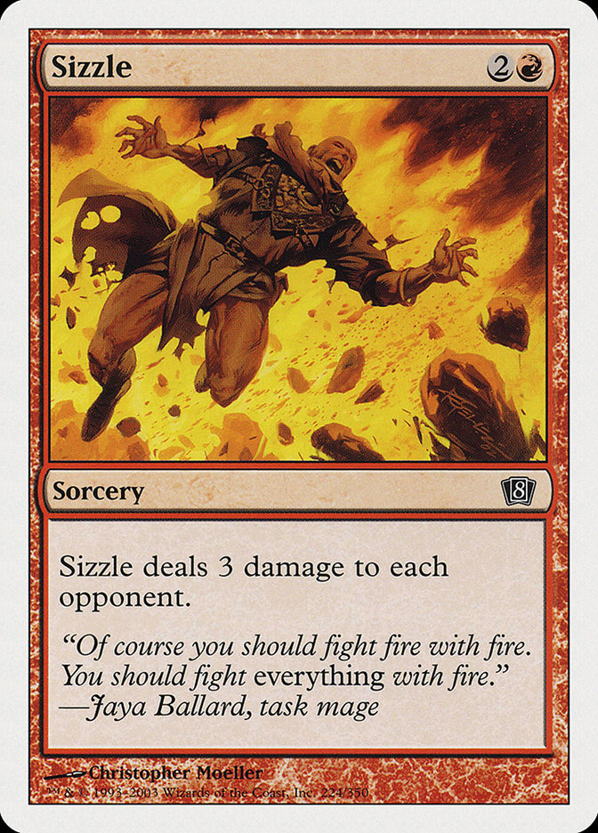

----

## Question 2/15 : histoire du jeu

Quelle extension, tristement célèbre pour avoir réimprimé massivement des cartes puissantes des premières éditions (comme *Arabian Nights* ou *Legends*), a provoqué la création de la **"Reserved List"** (Liste de Réserve) ?

1. **Fourth Edition**
2. **Chronicles**
3. **Homelands**
4. **Fallen Empires**

----

## Correction 2/15 : histoire du jeu

**Réponse** : 2. [**Chronicles**](https://scryfall.com/sets/chr) (1995)

Cette extension était entièrement composée de réimpressions de cartes d'extensions précédentes (comme *Legends*, *The Dark*, *Arabian Nights*), mais avec des bords blancs.

Sa sortie en grande quantité a fait chuter la valeur perçue des cartes originales (à bords noirs), provoquant la colère des collectionneurs et des magasins.

En réponse, *Wizards of the Coast* a créé la "Reserved List" en 1996, promettant de ne jamais réimprimer certaines cartes pour préserver leur valeur sur le marché secondaire.

----

## Question 3/15 : statistique sur les cartes

Parmi les types de créatures suivants (__en ne comptant pas "Humain"__), quel est celui qui apparaît sur le **plus grand nombre de cartes** imprimées (en papier, en cartes uniques, pas en nombre d'impressions différentes) ?

1. **Elfe**
2. **Soldat**
3. **Magicien**
4. **Vampire**

----

## Correction 3/15 : statistique sur les cartes

**Réponse** : 3. [**Magicien** (Wizard)](https://scryfall.com/search?q=t%3Acreature+game%3Apaper+t%3Awizard&unique=cards&as=grid&order=name)

En date d'aujourd'hui (2025), les décomptes sur Scryfall (comptant les cartes uniques, pas les impressions) sont :

1. **Magicien** : [1131 cartes](https://scryfall.com/search?q=t%3Acreature+game%3Apaper+t%3Awizard&unique=cards&as=grid&order=name)
2. **Soldat** : [1016 cartes](https://scryfall.com/search?q=t%3Acreature+game%3Apaper+t%3Asoldier&unique=cards&as=grid&order=name)
3. **Elfe** : [619 cartes](https://scryfall.com/search?q=t%3Acreature+game%3Apaper+t%3Aelf&unique=cards&as=grid&order=name)
4. **Vampire** : [422 cartes](https://scryfall.com/search?q=t%3Acreature+game%3Apaper+t%3Avampire&unique=cards&as=grid&order=name)

> (Le type "Humain" reste le plus courant, avec plus de 4 157 cartes actuellement).

----

## Question 4/15 : connaissance du lore

Quelle planeswalker a été tourmentée pendant la majeure partie de sa vie par une entité mystérieuse connue sous le nom de **"The Raven Man"** (L'Homme Corbeau) ?

1. **Nissa Revane**
2. **Kaya**
3. **Vraska**
4. **Liliana Vess**

----

## Correction 4/15 : connaissance du lore

**Réponse** : 4. [**Liliana Vess**](https://scryfall.com/card/cc2/1/liliana-heretical-healer-liliana-defiant-necromancer)

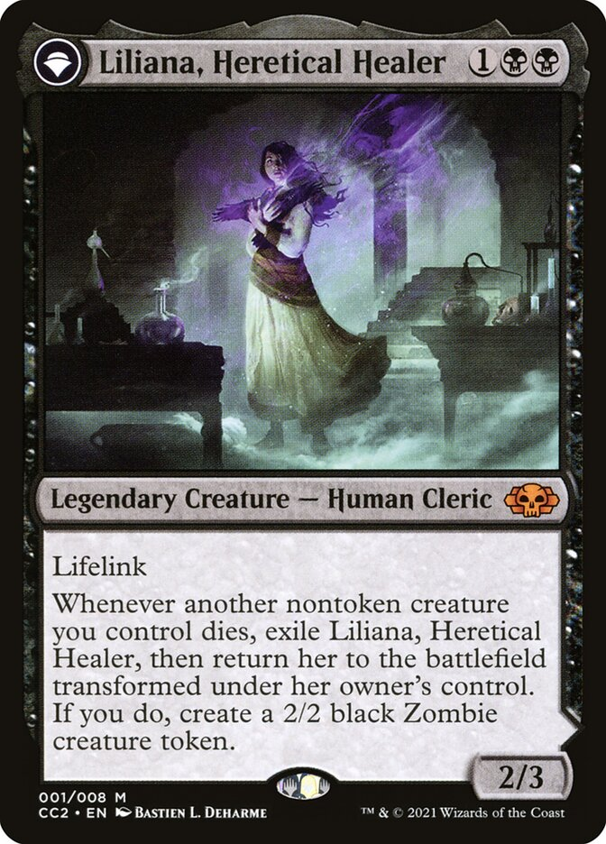

L'Homme Corbeau est apparu à Liliana pour la première fois sur Dominaria, avant même l'éveil de son étincelle. Il l'a manipulée et tourmentée, la poussant à maudire son frère alors qu'elle voulait le soigner.

Il a été révélé bien plus tard (dans l'histoire de <em>Dominaria United</em>) que l'Homme Corbeau était Lim-Dûl, un nécromancien ancien, lui-même influencé par le planeswalker Mairsil.

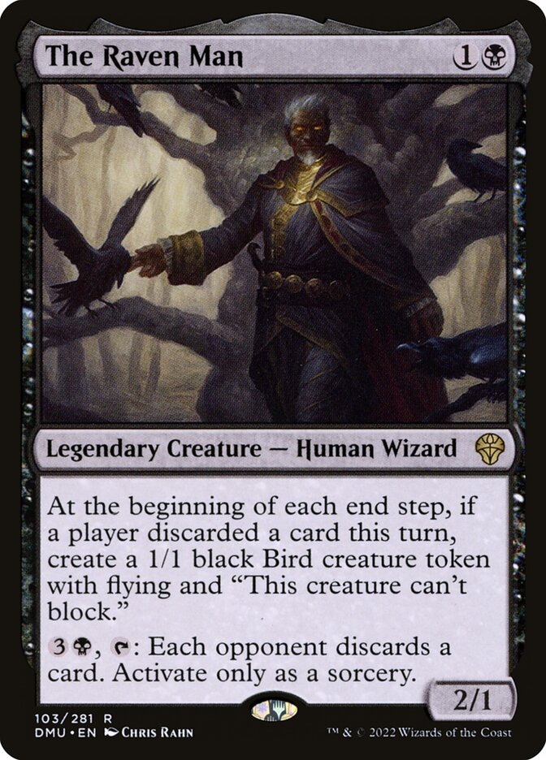

----

## Question 5/15 : connaissances des cartes

Parmi les cartes « **Ultimatums** » suivants, une seule n'existe **pas** en tant que carte imprimée dans *Magic: the Gathering*, laquelle ?

> En anglais : Brilliant Ultimatum ; Clarion U ; Cruel U ; Eerie U ; Emergent U ; Genesis U ; Inspired U ; Problematic U ; Ruinous U ; Titanic U ; Violent U

> En français : Ultimatum luminescent ; U claironnant ; U cruel ; U inquiétant ; U émergent ; U de genèse ; U inspiré ; U problématique ; U ruineux ; U titanesque ; U violent

----

## Correction 5/15 : connaissances des cartes

**Réponse** : 8. [**Problematic Ultimatum**](https://scryfall.com/search?q=Problematic+Ultimatum)

----

## Question 6/15 : connaissance des règles

Je contrôle un [**Ourson**](https://scryfall.com/card/fdn/552/bear-cub) (une créature 2/2).
Mon adversaire la cible avec un [**Choc**](https://scryfall.com/card/m21/159/fr/choc) (pour lui infliger 2 blessures).
Le Choc est sur la pile.
 
En réponse, je lance [**Projection**](https://scryfall.com/card/grn/127/fr/projection) (*Fling*), sacrifiant mon Ourson, pour infliger 2 blessures à mon adversaire.
 
L'action est-elle légale ?

1. **Oui**.
2. **Non**, la créature a déjà 2 blessures sur elle et ne peut pas être sacrifiée.
3. **Non**, la créature meurt avant que la Projection ne puisse être lancée.

----

## Correction 6/15 : connaissance des règles

**Réponse** : 1. **Oui**, l'action est parfaitement légale.

Les **Actions Basées sur l'État** (State-Based Actions), qui incluent la mort des créatures ayant des blessures létales ([Règle 704.5g](https://yawgatog.com/resources/magic-rules/#R7045g)), ne sont vérifiées que lorsqu'un joueur s'apprête à recevoir la priorité.

----

## Correction 6/15 : connaissance des règles

1. L'adversaire lance Choc (mis sur la pile).
2. Je reçois la priorité. En réponse, je lance Projection (mis sur la pile).
3. Pour lancer Projection, je dois payer ses coûts. Le sacrifice de l'Ourson est un **coût additionnel**.
4. À ce moment, l'Ourson est sur le champ de bataille et n'a *aucune* blessure sur lui (le Choc n'a pas encore résolu). Le sacrifice est donc légal.
5. Ma Projection (maintenant sur la pile) résout, j'inflige 2 blessures à mon adversaire.
6. Le Choc de l'adversaire tente de résoudre, mais sa cible (l'Ourson) n'existe plus. Le Choc est retiré de la pile par les règles (il "fizzle").

----

## Question 7/15 : connaissance des cartes

Laquelle de ces célèbres mécaniques de jeu (nommées en anglais) a une carte portant son nom exact (en anglais) ?

1. **Banding** (regroupement)
2. **Phasing** (déphasage)
3. **Flanking** (débordement)
4. **Fading** (disparition)
5. **Fly** (vol)
6. **Trample** (piétinement)
7. **Haste** (célérité)

----

## Correction 7/15 : connaissance des cartes

**Réponse** : 5. [**Fly** (vol)](https://scryfall.com/card/afr/59/fly)

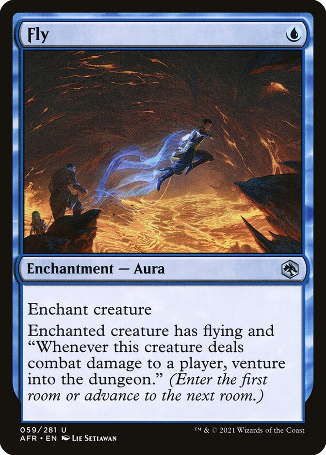

----

## Question 8/15 : connaissance du lore

Comment le titan Eldrazi, *Emrakul*, a-t-elle été neutralisée lors des événements de l'extension *La Lune Hermétique* (Eldritch Moon), sur Innistrad ?

1. Détruite par les Sentinelles (la *Gatewatch*) en combinant leurs pouvoirs ;
2. Attirée dans la lune d'argent d'Innistrad et emprisonnée à l'intérieur par Tamiyo ;
3. Bannnie du plan par Sorin Markov, avec l'aide d'Avacyn ;
4. Emrakul s'est volontairement sacrifiée pour corrompre le plan de l'intérieur.

----

## Correction 8/15 : connaissance du lore

**Réponse** : 2. **Attirée dans la lune d'argent d'Innistrad et emprisonnée à l'intérieur par Tamiyo.**

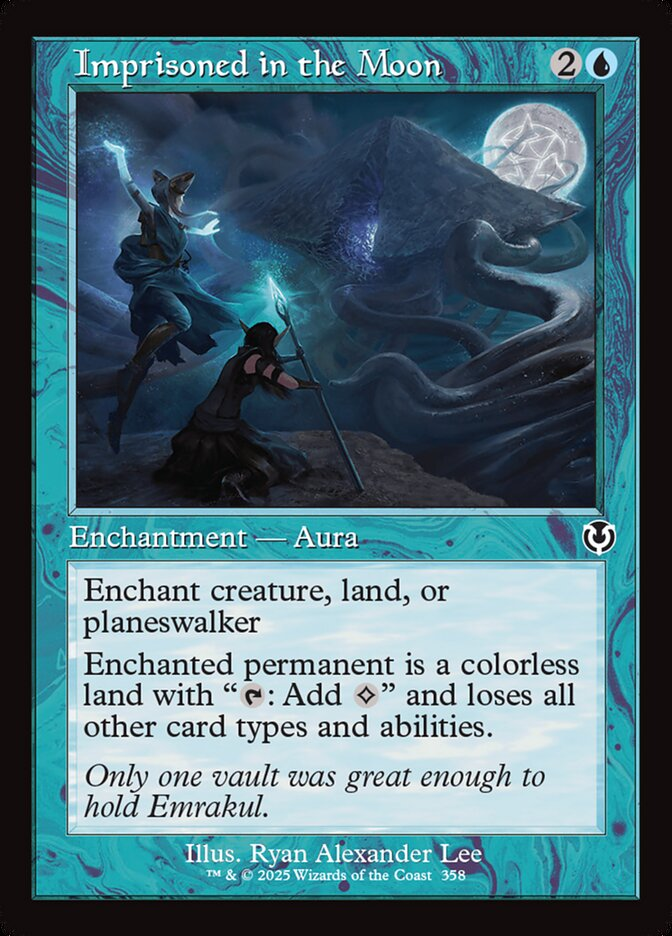

<small>
Alors que les Sentinelles étaient sur le point d'être vaincus, la planeswalker [Tamiyo](https://scryfall.com/card/emn/7/fr/tamiyo-chercheuse-sur-le-terrain) a utilisé un puissant sort d'emprisonnement, pour lier la conscience d'Emrakul à la lune d'Innistrad.
Il a été fortement sous-entendu qu'Emrakul s'est "laissée faire", murmurant "Je serai au seul endroit où je ne peux pas être atteinte" à Jace. (Les titans Ulamog et Kozilek ont été détruits sur Zendikar, mais Emrakul est toujours "vivante".)
</small>

----

## Question 9/15 : connaissance des règles

Laquelle de ces capacités activées n'est **PAS** une __capacité de mana__ (et utilise donc la pile, pouvant être contrée ou répondue) ?

1. La capacité du [**Pétale de lotus**](https://scryfall.com/card/plst/TMP-294/lotus-petal)
2. La première capacité du [**Shamane ritemort**](https://scryfall.com/card/rvr/175/fr/shamane-ritemort-(deathrite-shaman)) (Deathrite Shaman)
3. La capacité des [**Elfes de Llanowar**](https://scryfall.com/card/fdn/227/llanowar-elves)
4. La première capacité de l'[**Étoile chromatique**](https://scryfall.com/card/tsr/263/fr/%C3%A9toile-chromatique)

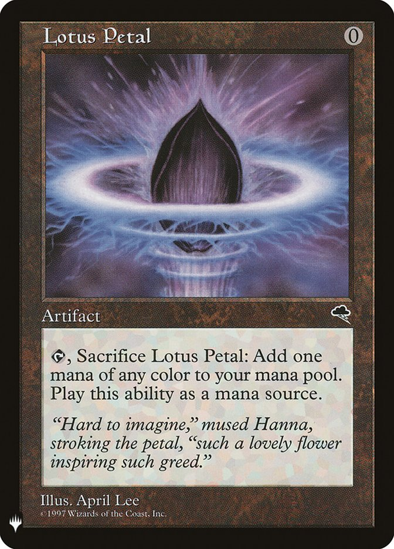
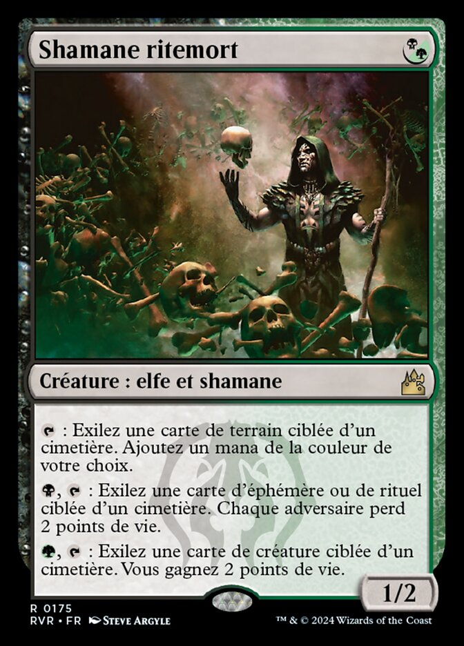

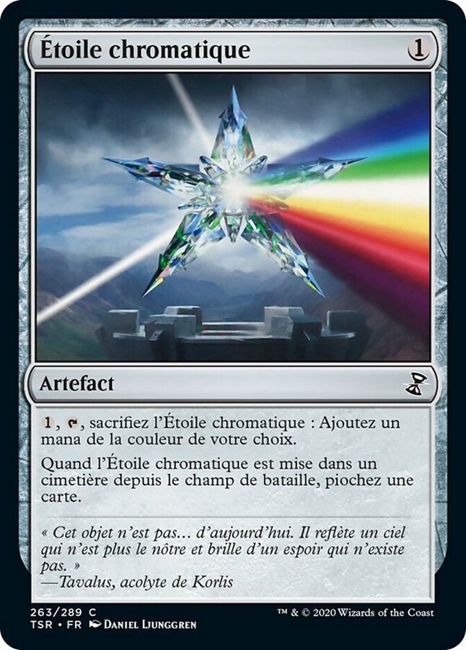

----

## Correction 9/15 : connaissance des règles

**Réponse** : 2. **La première capacité du [Shamane ritemort](https://scryfall.com/card/rvr/175/fr/shamane-ritemort-(deathrite-shaman))** (Deathrite Shaman)

La Règle **605.1a** définit ce qu'est une capacité de mana. Pour en être une, une capacité activée doit (entre autres) :

1. Ne pas être une capacité de loyauté.
2. Ne pas nécessiter de cible (ne pas avoir le mot "ciblé" ou "target").
3. Produire du mana quand elle se résout.

La première capacité du Shamane Ritemort ("Exilez une carte de terrain ciblée d'un cimetière...") **cible** une carte. Par conséquent, ce n'est *pas* une capacité de mana. Elle utilise la pile et on peut y répondre (par exemple, en exilant le terrain ciblé avec un autre effet avant la résolution).

----

## Question 10/15 : connaissance des artistes

Parmi les artistes suivants, lequel n'a **JAMAIS** illustré de carte appelé **Black Lotus**, depuis l'origine de *Magic: the Gathering* jusqu'à aujourd'hui ?

1. **Christopher Rush**
2. **Chris Rain**
3. **John Avon**
4. **Raoul Vitale**

----

## Correction 10/15 : connaissance des artistes

**Réponse** : 3. **John Avon** !

1. [Christopher Rush](https://scryfall.com/card/lea/233/black-lotus) a illustré la carte originale de 1993, dans *Limited Edition Alpha*.
2. [Chris Rain](https://scryfall.com/card/vma/4/black-lotus) a illustré la réimpression de 2013 dans *Vintage Masters*.
3. John Avon n'a **jamais** illustré de carte **Black Lotus**.
4. [Raoul Vitale](https://scryfall.com/card/ovnt/2023EU/black-lotus) a illustré la réimpression *2023 Europe Vintage Championship*.

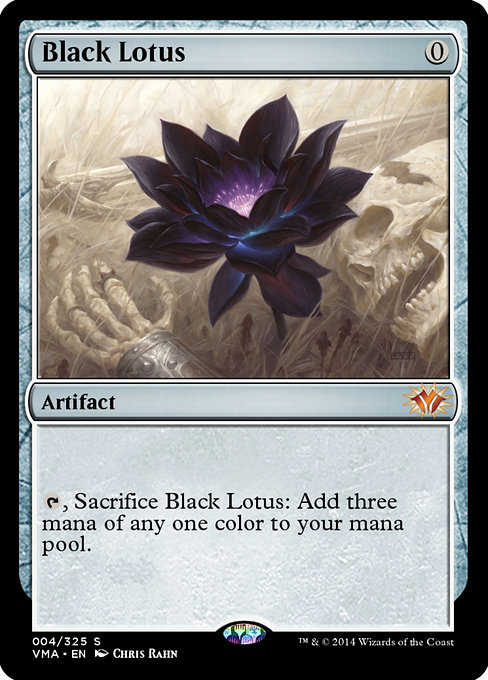
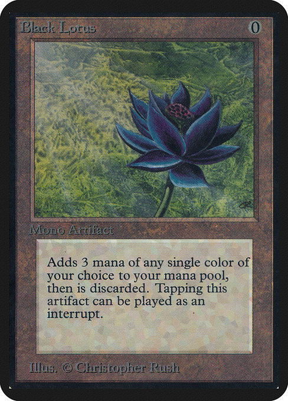
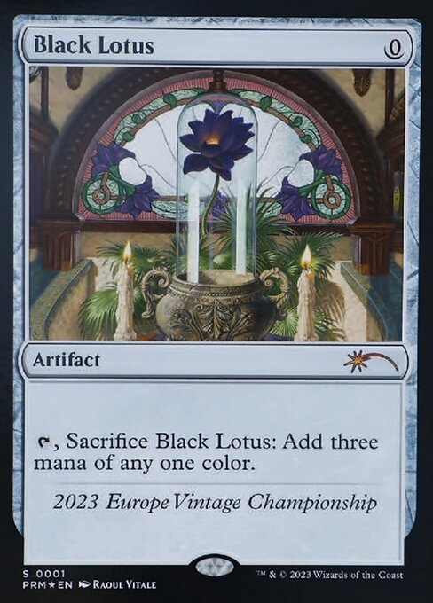

Cf. [cette requête Scryfall](https://scryfall.com/search?as=grid&order=released&q=%21%22Black+Lotus%22+oracleid%3A5089ec1a-f881-4d55-af14-5d996171203b+include%3Aextras&unique=prints) pour la liste complète des illustrations de **Black Lotus**.

----

## Question 11/15 : Connaissance des cartes

Il n'existe qu'une seule carte (à bord noir, non-Un) imprimée avec la capacité textuelle inconditionnelle, **"Protection contre tout"** (Protection from everything).
Laquelle ?

1. [**Progenitus**](https://scryfall.com/card/con/121/progenitus)
2. [**Colosse de sombracier**](https://scryfall.com/card/m10/208/darksteel-colossus) (Darksteel Colossus)
3. [**Le Tarrasque**](https://scryfall.com/card/afr/207/the-tarrasque)
4. [**Emrakul, Déchirure des Éons**](https://scryfall.com/card/2x2/1/fr/emrakul-d%C3%A9chirure-des-%C3%A9ons-(emrakul-the-aeons-torn))

----

## Correction 11/15 : Connaissance des cartes

**Réponse** : 1. [**Progenitus**](https://scryfall.com/card/mma/182/fr/progenitus)

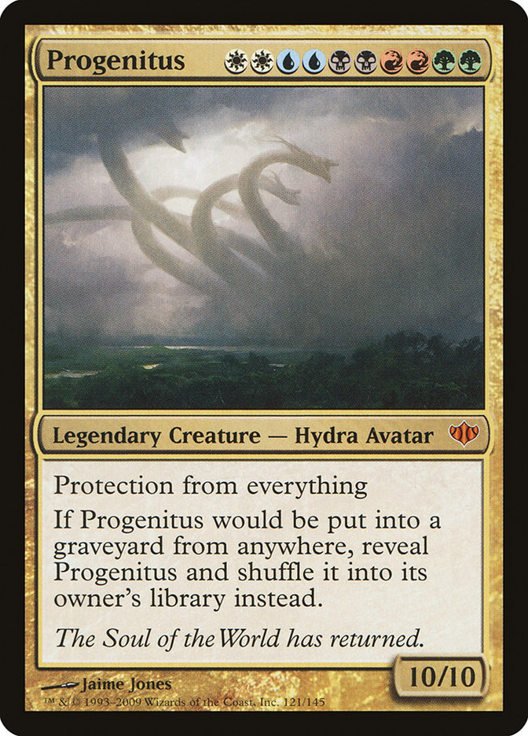

Imprimée à l'origine dans *Conflux*, Progenitus est la seule carte avec le texte de règle "Protection contre tout". Cela signifie qu'il ne peut pas être bloqué, ciblé, ou se voir infliger des blessures par quoi que ce soit.

<!-- (sauf exceptions comme les colères de dieu, qui ne ciblent pas et ne font pas de blessures). -->

- Le Colosse de Sombracier est indestructible (mais peut être ciblé, exilé, etc.) ;
- Le Tarrasque a la parade <i class="mi mi-mana mi-10 mi-shadow mi-1x"></i>, s'il a été lancé ;
- Emrakul a une protection contre les sorts qui ont au moins une couleur.

----

## Question 12/15 : Connaissance du lore

Qui était la capitaine *originale* du navire volant **"L'Aquilon"** (The Weatherlight), avant que Gerrard Capashen ne prenne la relève lors du bloc *Tempête* ?

1. **Hanna**
2. **Orim**
3. **Mirri**
4. **Sisay**

----

## Correction 12/15 : Connaissance du lore

**Réponse** : 4. [**Sisay**](https://scryfall.com/card/tsr/261/fr/capitaine-sisay)

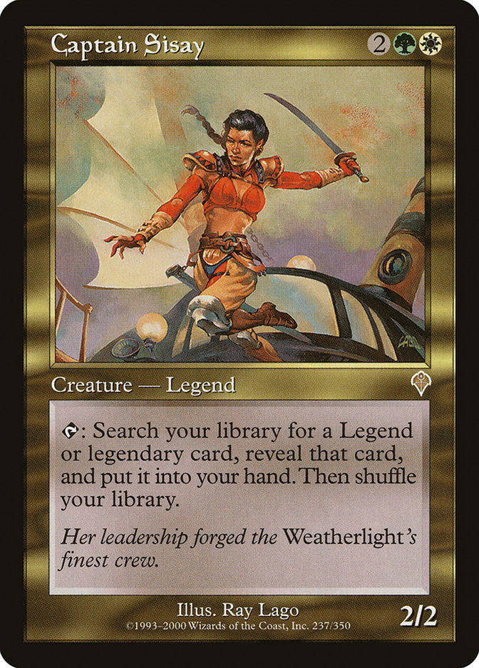

La Capitaine Sisay était la descendante de la lignée qui pilotait l'Aquilon. L'intrigue principale du bloc *Tempête* commence lorsque Sisay est kidnappée par Volrath (l'Evincar de la Forteresse), et que Gerrard Capashen (un vieil ami et l'héritier de l'Héritage) est recruté par l'équipage pour la sauver et reprendre le commandement du navire.

---

## Question 13/15 : connaissance des règles

Laquelle/lesquelles de ces cartes a/ont une Capacité de Définition de Caractéristiques (CDC) ?

1. **Tarmogoyf**
2. **Knight of the Reliquary**
3. **Death's Shadow**
4. **Serra Avatar**

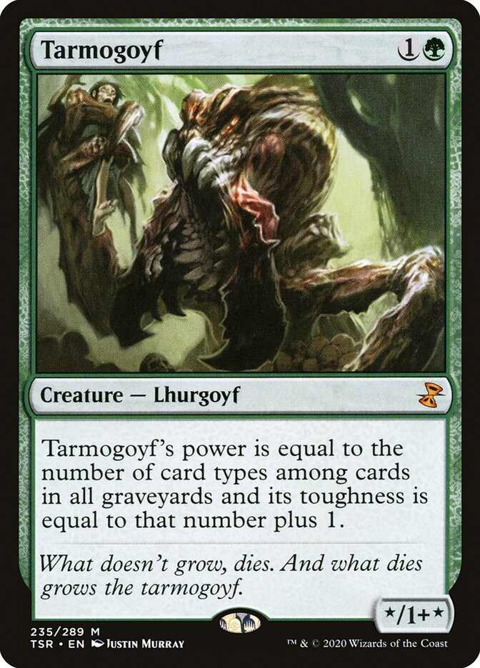
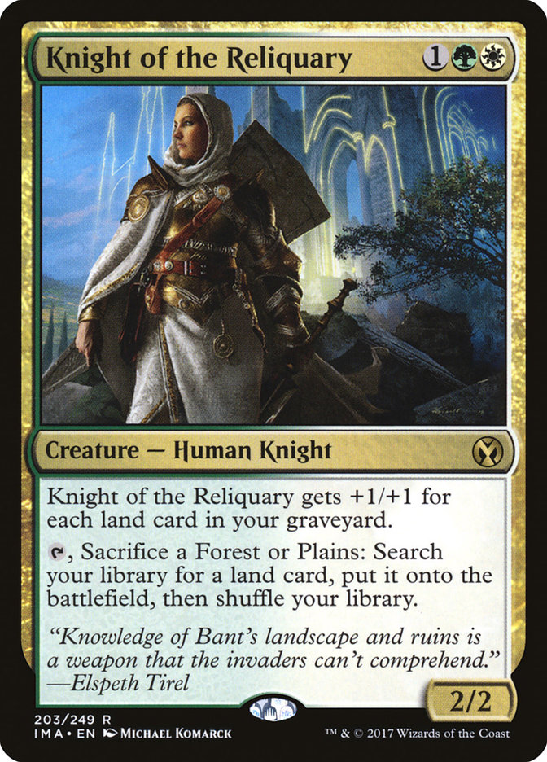
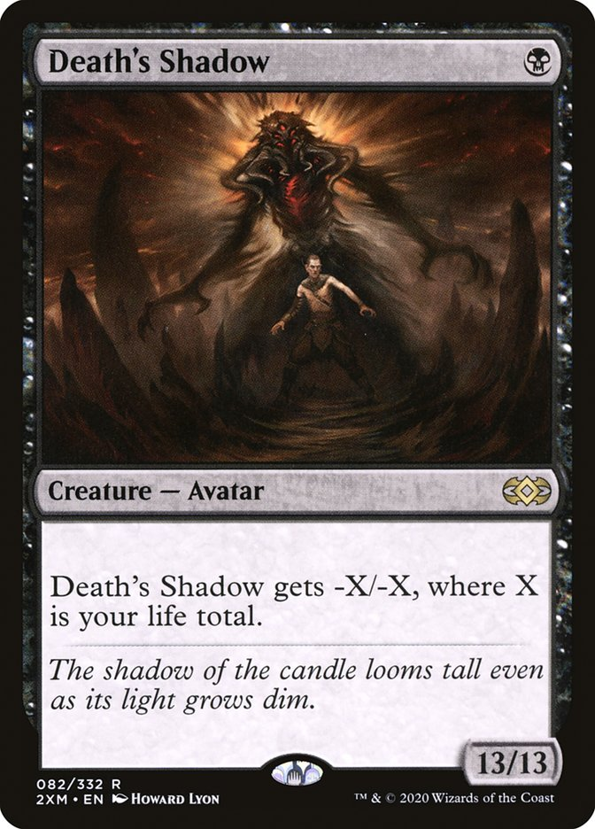
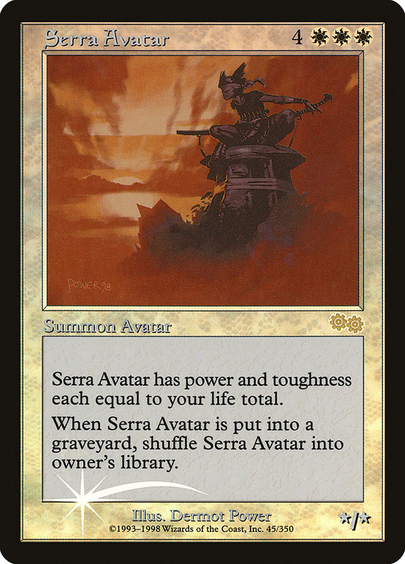

----

## Correction 13/15 : connaissance des règles

Les CDC définissent les caractéristiques **en tout lieu**.

Les seules CDC ici sont les capacités du **Tarmogoyf** et de **Serra Avatar**.

----

## Question 14/15 : connaissance des règles en EDH

En multi-joueurs EDH, le joueur actif (Aragorn) n'est pas le monarque, il inflige des blessures léthales par un sort (et pas des blessures de combat), à un de ses adversaires (Bolas), qui est actuellement le monarque.
Que devient le statut de monarque ?

1. Le joueur actif (Aragorn) devient le monarque ;
2. Le joueur qui a infligé les blessures létales (Aragorn) devient le monarque ;
3. Le statut de monarque est retiré de la partie ;
4. Le voisin de gauche du joueur monarque (Caesar) devient le monarque.

----

## Réponse 14/15 : connaissance des règles en EDH

**Réponse** : 1. **Le joueur actif (Aragorn) devient le monarque**.

----

## Question 15/15 : connaissance des cartes

Combien existe-t-il de cartes en tout, qui représentent __les parents__ du plus mignon petit singe de tout Magic, [**Kibo, prince de l'Ouktabi**](https://scryfall.com/card/j22/40/fr/kibo-prince-de-louktabi) ?

> 1. aucune, **Kibo** n'existe pas et a été inventé pour cette question !
> 2. une seule, l'[**Orang-outang de l'Ouktabi**](https://scryfall.com/card/vis/123/uktabi-orangutan) de Visions (1996),
> 3. deux, avec aussi le [**Uktabi Kong**](https://scryfall.com/card/unh/115/uktabi-kong) à bords argentés,
> 4. trois, **Kibo** lui-même étant représenté avec ses parents.

----

## Correction : Question 21/20

Réponse : trois, **Kibo** lui-même étant représenté avec ses parents.

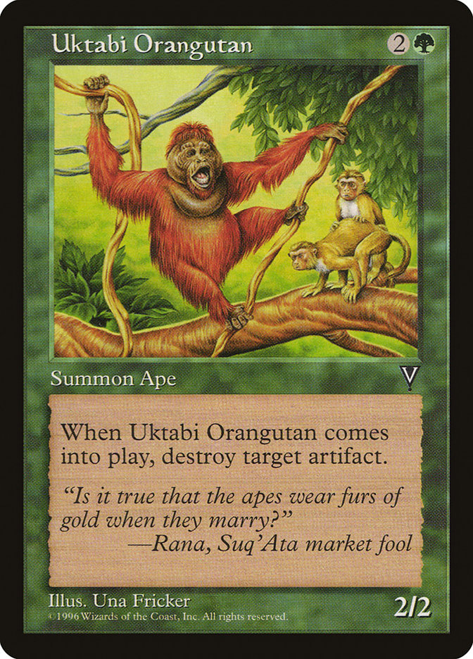
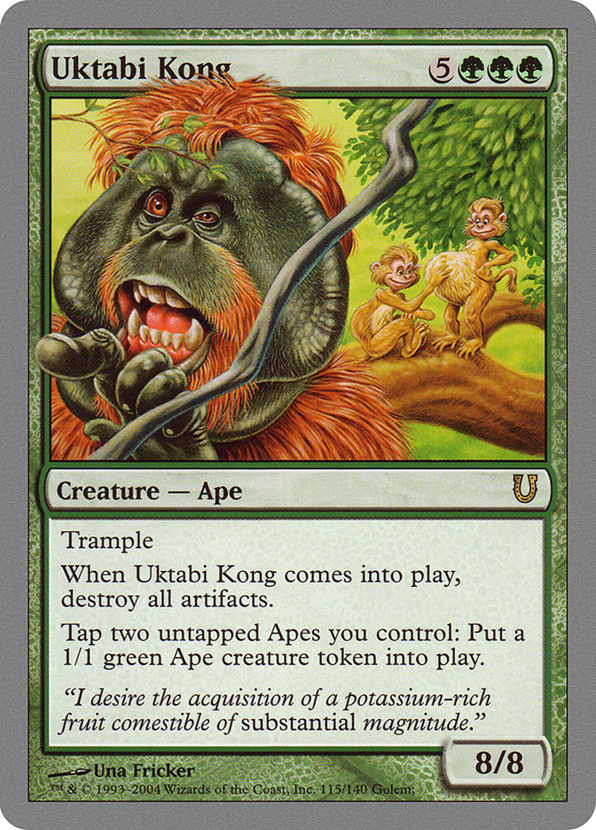
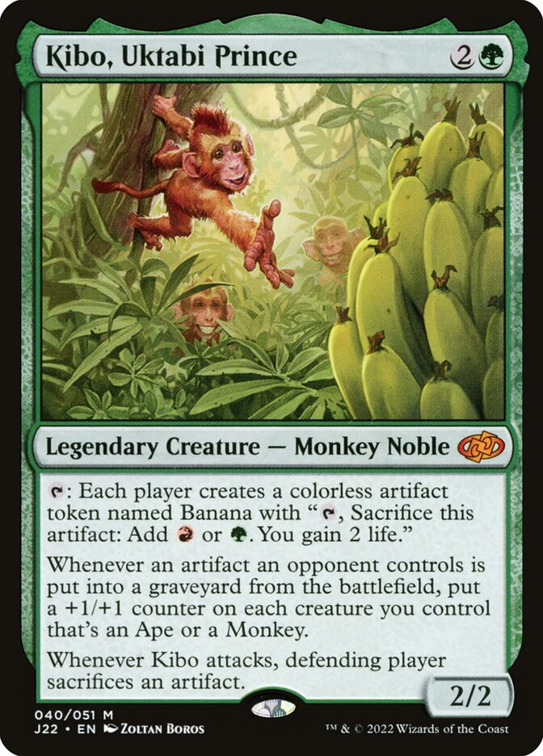

----

## Fin du Quiz !

  

### 🎉 Bravo à tous et toutes, merci de votre participation ! 🎉

 

### 🎁 Calcul des scores et distribution des lots ! 🎁

----

## A propos de ce *Quiz Magic*

<small>

- *Astuce* : utilisez "S" / "B" pour diminuer/augmenter la taille du texte ;
- Écrite en [Markdown](https://en.wikipedia.org/wiki/Markdown), un langage à balise léger et libre ;
- Convertie en slides web avec [`pandoc`](https://pandoc.org/), avec l'option "slidy" ;
- Utilise les polices spéciales *Magic the Gathering* : [Planewalker](https://www.cufonfonts.com/font/planewalker) pour le texte, [Keyrune](https://keyrune.andrewgioia.com/index.html) pour les symboles d'extension, [Alexandre Arpin's Font](http://alexandrearpin.com/mtg-font/icons.html) pour les autres symboles ; <!-- TODO: there is also this font, which includes Planeswalker symbols: https://mana.andrewgioia.com/icons.html -->
- Utilise la base de données `AllPrintings.sqlite` du projet [MTG JSON](https://mtgjson.com/downloads/all-files/#allprintings) pour vérifier certaines réponses ;
- Open-source et libre, [sur mon GitHub](https://github.com/Naereen/Un-Quiz-Magic-the-Gathering-pour-le-festival-Don-des-Dragons) ;
- [MIT Licensed](https://lbesson.mit-license.org/), (c) [Lilian Besson (Naereen), 2024-2025](https://besson.link).

</small>
