<link href="https://alexandrearpin.com/mtg-font/css/magic-font.css" rel="stylesheet" type="text/css" />
<link href="https://cdn.jsdelivr.net/npm/keyrune@latest/css/keyrune.css" rel="stylesheet" type="text/css" />

# Un Quiz sur *Magic: the Gathering*

Bienvenue dans ce quiz sur *Magic: the Gathering* <i class="mi mi-planeswalk mi-1x"></i>, notre jeu préféré !

. . .

Il y aura *20* questions, 5 fois de suite selon ce motif :

- 1 question "plus dure", valant 2 points chacune,
  avec un bonus valant 1 point de plus !
- 4 questions "plutôt faciles", en QCM à deux ou quatre choix,
  valant 1 point chacune,

. . .

Répondez sur vos ardoises, et à chaque question nous compterons les bonnes ou mauvaises réponses !

-----------------------------------

## Question 1/20 : connaissance de l'histoire du jeu (dure)

- Comment s'appelle l'extension ayant ce symbole ?

<!-- 
<i class="ss ss-sth ss-6x"></i>
 -->
<!-- 
<i class="ss ss-lgn ss-6x"></i>
 -->

<i class="ss ss-con ss-6x"></i>

- **Bonus** : *estimer* en quelle année elle est sortie ?

----

## Correction : Question 1/20

<!-- **Réponse** : extension Forteresse (Stronghold, STH)
143 cards, sortie le 02 mars 1998 -->

<!-- **Réponse** : extension Légions (Legions, LGN)
145 cartes, sortie le 03 février 2003 -->

**Réponse** : extension **Conflux** (CON)

<i class="ss ss-con ss-6x"></i>

<!-- 145 cartes -->
Sortie le **06 février 2009**.
<!-- (je me souviens des avant-premières, c'était top !) -->

----

## Question 2/20 : estimation statistique sur les cartes

Quel type de créature est le **<ins>second</ins> le plus représenté** dans la couleur rouge <i class="mi mi-mana mi-r mi-shadow mi-1x"></i> ?

> 1. [Dragon](https://scryfall.com/search?q=id%3Dr+t%3Dcreature+game%3Dpaper+t%3Ddragon)
> 2. [Humain](https://scryfall.com/search?q=id%3Dr+t%3Dcreature+game%3Dpaper+t%3Dhuman)
> 3. [Gobelin](https://scryfall.com/search?q=id%3Dr+t%3Dcreature+game%3Dpaper+t%3Dgoblin)
> 4. [Guerrier](https://scryfall.com/search?q=id%3Dr+t%3Dcreature+game%3Dpaper+t%3Dwarrior)

----

## Correction : Question 2/20

**Réponse** :

> 1. 148 dragons rouges
> 2. 497 humains rouges
> 3. **370 goblins rouges**
> 4. 339 guerriers rouges

<!--
: **c'est donc la bonne réponse**
(vérifiée en SQL avec [la base de données complète des cartes Magic the Gathering](https://mtgjson.com/downloads/all-files/#allprintings))
TODO: check the answer, using AllPrintings.sqlite and some well-written SQL code
See: https://mtgjson.com/downloads/all-files/#allprintings
-->

----

## Question 3/20 : connaissance du *lore*

Qui emprisonna [**Nicol Bolas**](https://scryfall.com/card/tsb/98/nicol-bolas) sur le plan de *Dominaria*,
avant sa libération lors des événements du [bloc Spirale Temporelle](https://scryfall.com/sets/tsp) ?

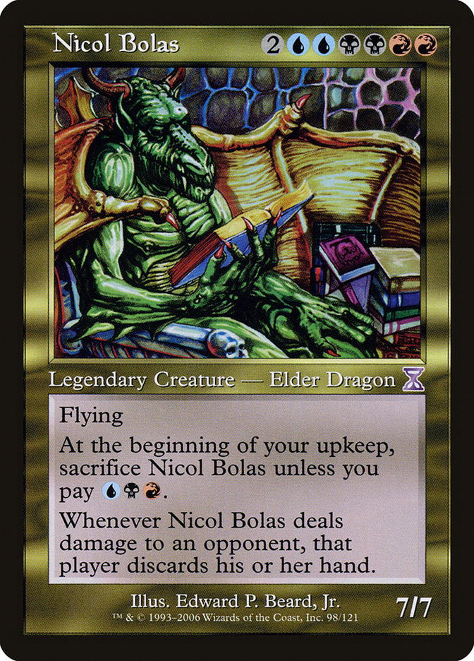

 

> 1. Son frère, [**Ugin**](https://scryfall.com/card/m3c/160/ugin-the-ineffable)
> 2. Un rival, [**Arcades Sabboth**](https://scryfall.com/card/dmr/355/arcades-sabboth)
> 3. Un héro antique, [**Tetsuo Umezawa**](https://scryfall.com/card/leg/262/tetsuo-umezawa)
> 4. Un arpenteur, [**Urza**](https://scryfall.com/card/bro/238b/urza-planeswalker)

----

## Correction : Question 3/20

**Réponse** : 3. Un héro antique, [**Tetsuo Umezawa**](https://scryfall.com/card/leg/262/tetsuo-umezawa).

[Source](https://mtg.fandom.com/wiki/Tetsuo_Umezawa#Champion_against_emperor) : Wiki MTG.fandom.com :

> Bolas was furious over the death of his regent. 
> Tetsuo fled to the Meditation Plane and Bolas followed. 
> This proved a mistake for the Elder Dragon however, Tetsuo had cast the **Meteor Hammer** spell. 
> The spell destroyed the Imperial Shrine, thus destroying the mana foothold Bolas needed to stay in Dominaria. 
> Denied his powers as a planeswalker, Bolas was defeated by Tetsuo.

----

## Question 4/20 : connaissance des règles

Antoine enchante ses [**Cavernes aux gemmes**](https://scryfall.com/card/tsr/280/gemstone-caverns), qui a un marqueur "Chance", avec [**Croissance abondante**](https://scryfall.com/card/dmc/128/abundant-growth).
Au tour suivant, Nathan lance [**Mage de la lune**](https://scryfall.com/card/tsr/175/magus-of-the-moon).

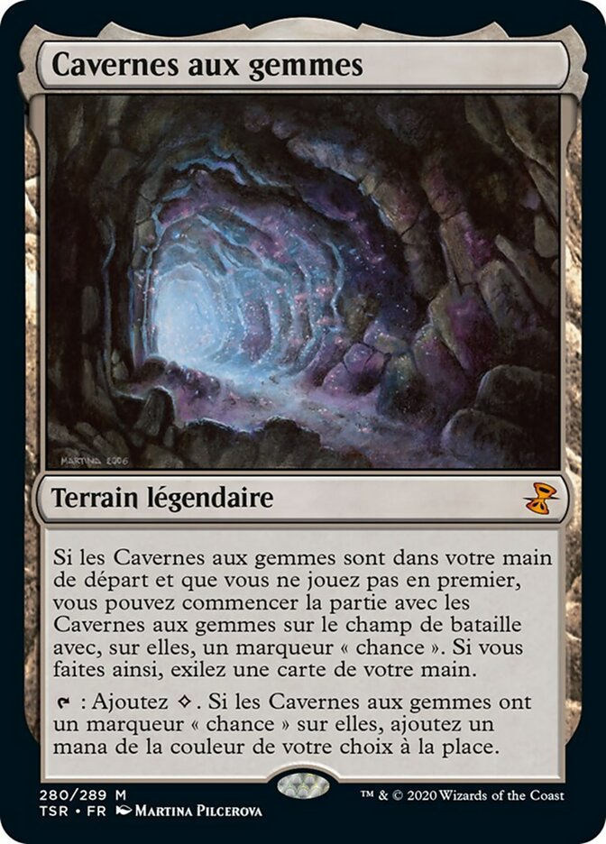
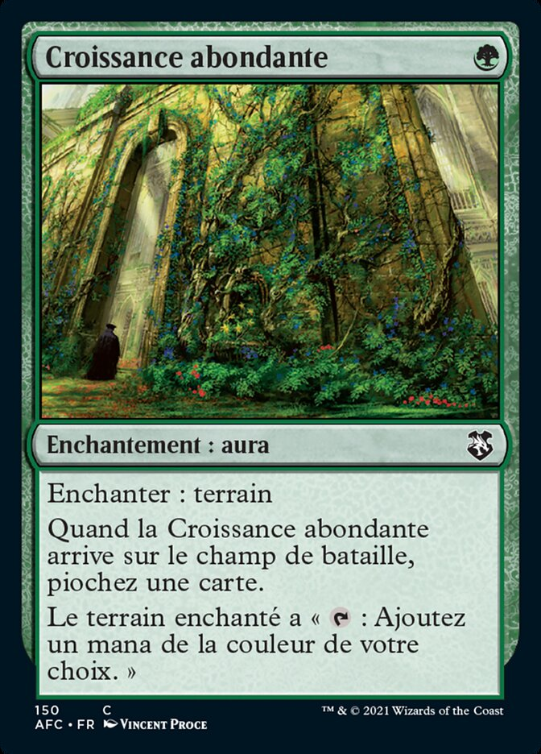
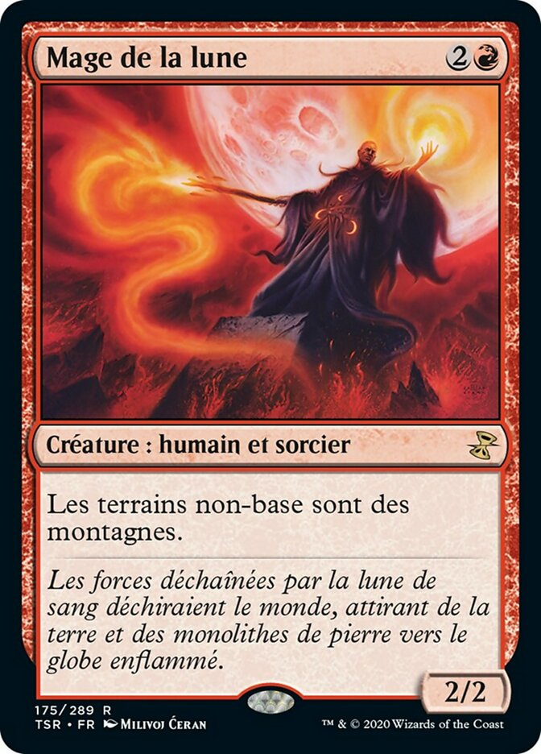

Quelle(s) couleur(s) de mana les [**Cavernes aux gemmes**](https://scryfall.com/card/tsr/280/gemstone-caverns) pourront-elles désormais produire en s'engageant <i class="mi mi-tap mi-mana mi-1x"></i> ?

----

## Correction : Question 4/20

<!-- **Réponse** : Any color. Magus of the Moon operates in the type-changing layer (613.1d) which is applied before the ability adding and removing layer. (613.1f) Gemstone Caverns is a Mountain, with the additional ability "<i class="mi mi-tap mi-mana mi-1x"></i> : Add one mana of any color.". -->

**Réponse** : **N'importe quelle couleur**.

Le **Mage de la Lune** opère dans la couche de changement de types (Règle *613.1d*),
qui est appliquée avant la couche d'ajout et de suppression de capacité (*613.1f*).

Les **Cavernes aux Gemmes** sont donc une montagne (non basique), avec la capacité additionnelle
"<i class="mi mi-tap mi-mana mi-1x"></i> : Ajouter un mana de la couleur de votre choix".

----

## Question 5/20 : connaissance de l'histoire du jeu

Laquelle de ces éditions n'a **<ins>pas de carte à son nom</ins>** (VF ou VO) :

 

> 1. [**Épopée d'Urza** (USG)](https://scryfall.com/sets/usg)
> 2. [**Chaos planaire** (PLC)](https://scryfall.com/sets/plc)
> 3. [**Visions de l'avenir** (FUT)](https://scryfall.com/sets/fut)
> 4. [**Destin reforgé** (FRF)](https://scryfall.com/sets/frf)

----

## Correction : Question 5/20

**Réponse** : 4. [**Destin reforgé** (FRF)](https://scryfall.com/sets/frf) n'a pas de carte à son nom.

> 1. <i class="ss ss-usg ss-1x"></i> Urza's Saga (usg) a [sa carte dans Modern Horizon 2 (MH2)](https://scryfall.com/card/mh2/259/urzas-saga)
> 2. <i class="ss ss-plc ss-1x"></i> Planar Chaos (plc) a [sa carte dans Jugement (JUD)](https://scryfall.com/card/jud/97/planar-chaos)
> 3. <i class="ss ss-fut ss-1x"></i> Future Sight (fut) a [sa carte dans Carnage (ONS)](https://scryfall.com/card/ons/84/future-sight)
> 4. **Réponse** : <i class="ss ss-frf ss-1x"></i> Destin reforgé (frf) n'a **pas** de carte a son nom.

----

## Question 6/20 : sur le format Pauper (dure)

Laquelle de ces cartes communes n'est **<ins>pas légale</ins>** en Pauper ?

> 1. [**Étude Rhystique** (Rystic Study)](https://scryfall.com/card/pcy/45/fr/etude-rhystique)
> 2. [**Hébétude** (Daze)](https://scryfall.com/card/nem/30/fr/h%C3%A9b%C3%A9tude)
> 3. [**Pétal de lotus** (Lotus Petal)](https://scryfall.com/card/tmp/294/fr/p%C3%A9tale-de-lotus)
> 4. [**Rémora mystique** (Mystic Remora)](https://scryfall.com/card/ice/87/fr/r%C3%A9mora-mystique)

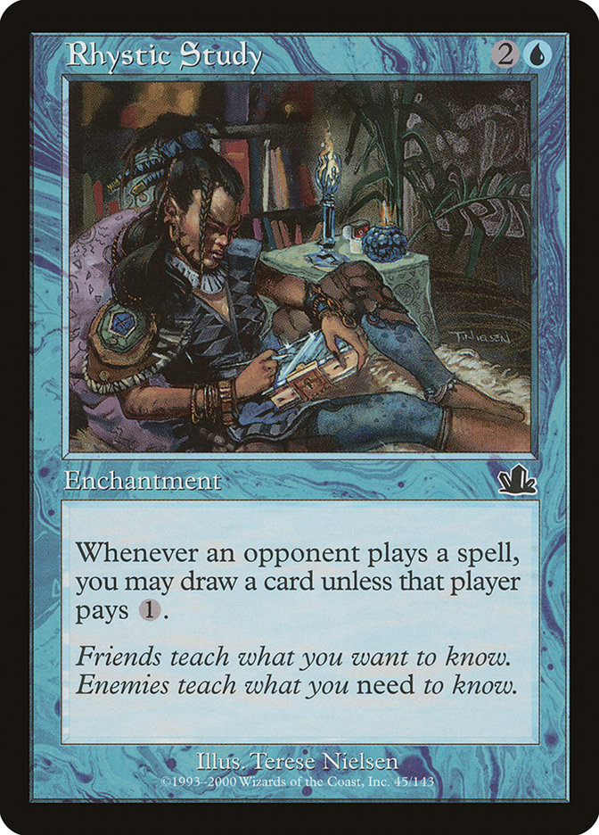 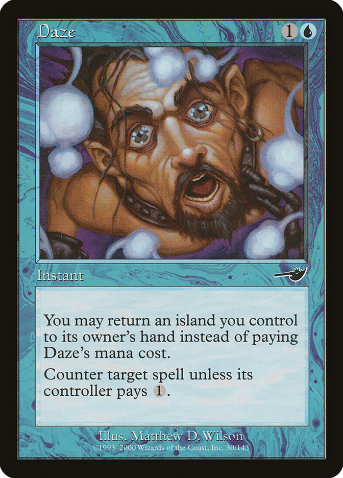 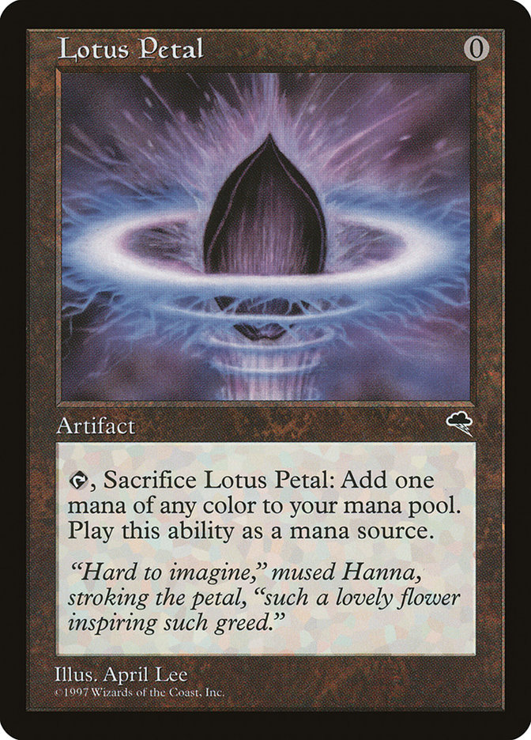 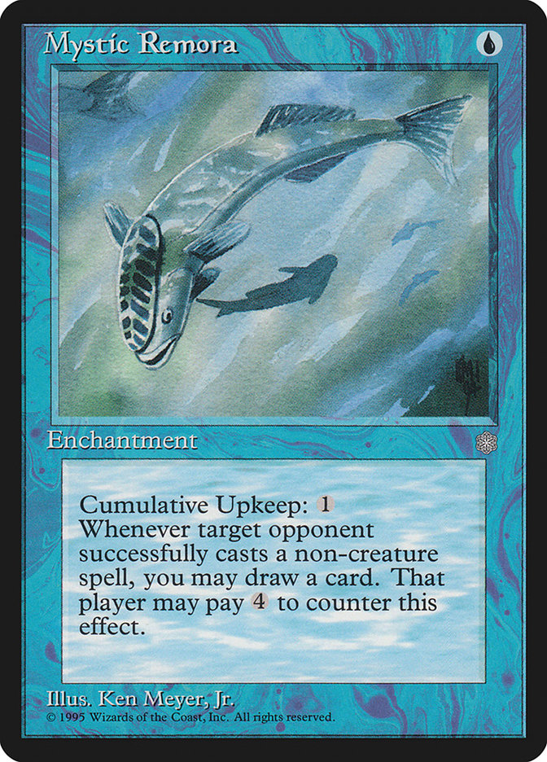

----

## Correction : Question 6/20

**Réponse** : 2. [**Hébétude** (Daze)](https://scryfall.com/card/nem/30/fr/h%C3%A9b%C3%A9tude)

Les quatre ont été éditées dans leur première édition à la rareté commune, mais 2. [**Hébétude** (Daze)](https://scryfall.com/card/nem/30/fr/h%C3%A9b%C3%A9tude) est la seule à être **bannie en Pauper**.

----

## Question 6/20 : sur le format Pauper - Bonus (dure)

   

**Bonus :** laquelle de ces quatre cartes a le prix moyen sur CardMarket.com le plus élevé ?
Dans sa version la moins chère, en VO en anglais (*"prix moyen"*, tel qu'affiché sur Scryfall hier soir).

----

## Correction : Question 6/20 - Bonus

<!-- TODO: rafraîchir la réponse la veille du quiz ! -->
**Réponse** : **31€** en tendance des prix pour la
[version la moins chère (Prophecy) de Rhystic Study](https://scryfall.com/card/pcy/45/rhystic-study).

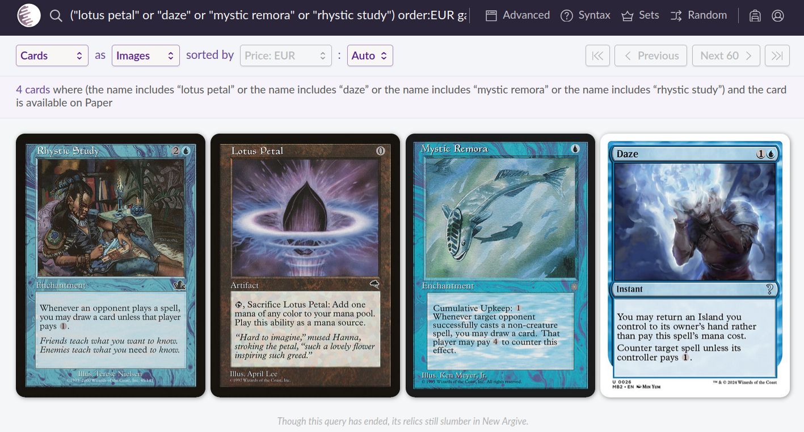

----

## Question 7/20 : connaissance des cartes

Quel est le coût converti de mana le plus élevé imprimé à bords noirs (donc pas à bords argentés) ?

 

> 1. <i class="mi mi-13 mi-mana mi-1x"></i>
> 2. <i class="mi mi-15 mi-mana mi-1x"></i>
> 3. <i class="mi mi-16 mi-mana mi-1x"></i>
> 4. <i class="mi mi-18 mi-mana mi-1x"></i>

----

## Correction : Question 7/20

La réponse est <i class="mi mi-16 mi-mana mi-1x"></i>,
avec la carte [Draco](https://scryfall.com/search?q=draco+cmc%3D16) de l'extension Planeshift
(sortie en 2001).

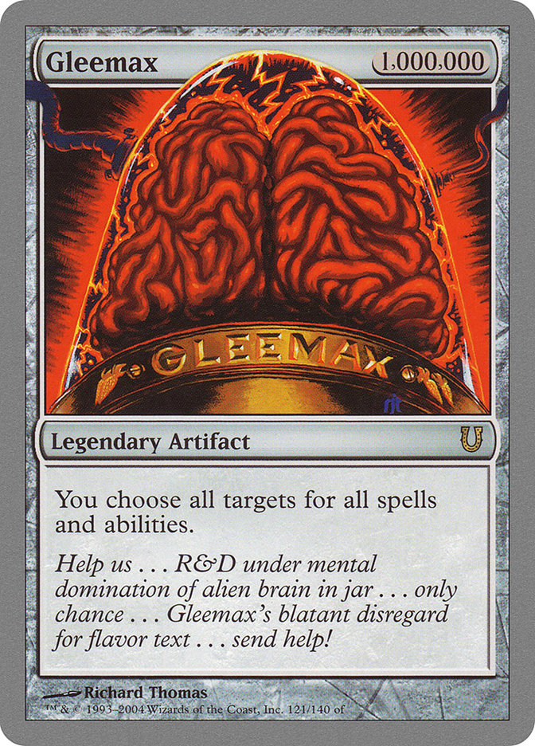
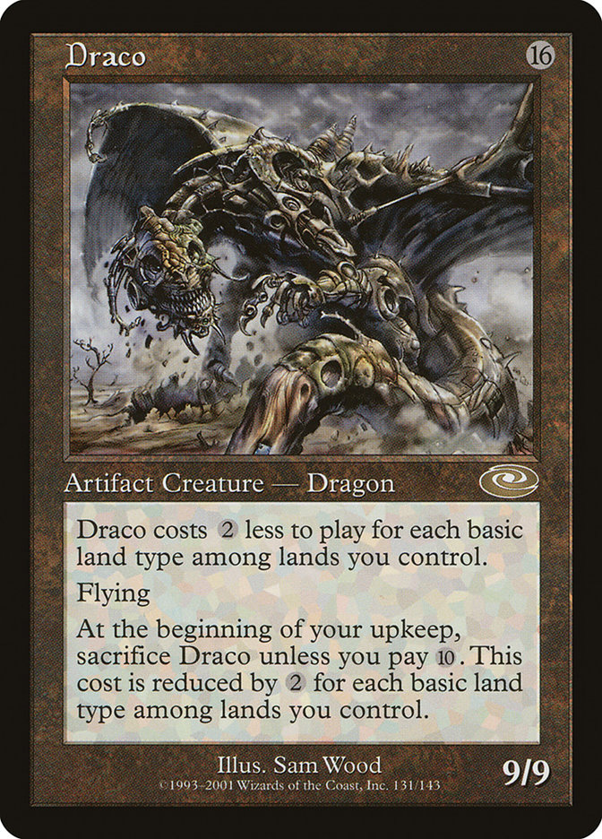

En comptant les cartes à bords argentés, il s'agit de [**Gleemax**](https://scryfall.com/card/unh/121/gleemax) qui a un coût de mana de 1.000.000 (un million de manas incolores).

----

## Question 8/20 : sur une illustration très originale, que j'aime beaucoup

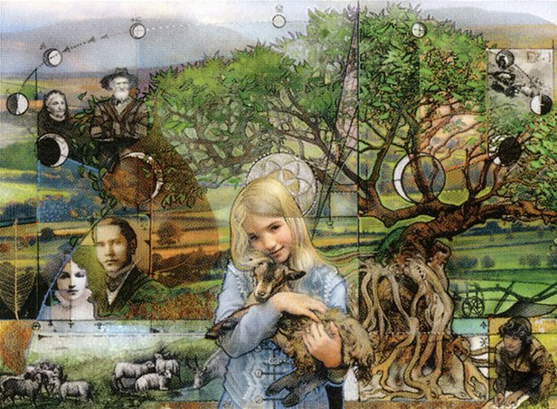
Qui est l'artiste ayant illustré la carte [**Chemin des descendants**](https://scryfall.com/card/avr/173/fr/chemin-des-descendants) de l'édition *Avacyn Restored* en 2012 ?

> 1. [**Rebecca Guay**](https://scryfall.com/search?q=a%3A%E2%80%9CRebecca+Guay%E2%80%9D&unique=art&as=grid&order=name)
> 2. [**Rob Alexander**](https://scryfall.com/search?q=a%3A%E2%80%9CRob+Alexander%E2%80%9D&unique=art&as=grid&order=name)
> 3. [**Terese Nielsen**](https://scryfall.com/search?q=a%3A%E2%80%9CTerese+Nielsen%E2%80%9D&unique=art&as=grid&order=name)
> 4. [**Aleksi Briclot**](https://scryfall.com/search?q=a%3A%E2%80%9CAleksi+Briclot%E2%80%9D&unique=art)

----

## Correction : Question 8/20

**Réponse** : il s'agit de 3. [**Terese Nielsen**](https://scryfall.com/search?q=a%3A%E2%80%9CTerese+Nielsen%E2%80%9D&unique=art&as=grid&order=name).

Elle est notamment connue pour le cycle des *"Guru Lands"*, les terrains de base les plus chers de tout Magic (1040€ le premier prix pour une **Île** !), qui ont aussi ce style riche en détails "astronomiques".

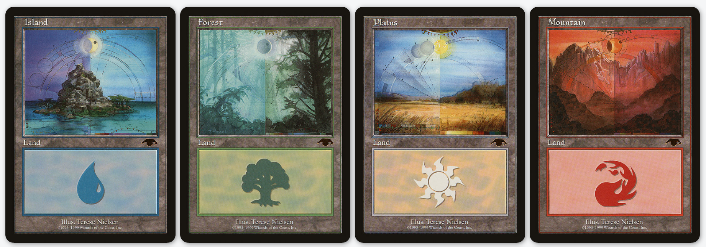

----

## Question 9/20 : connaissance des règles

Dans ma bibliothèque, quelle est la force du [**Changeforme corrompu**](https://scryfall.com/card/mh3/56/fr/changeforme-corrompu) ?

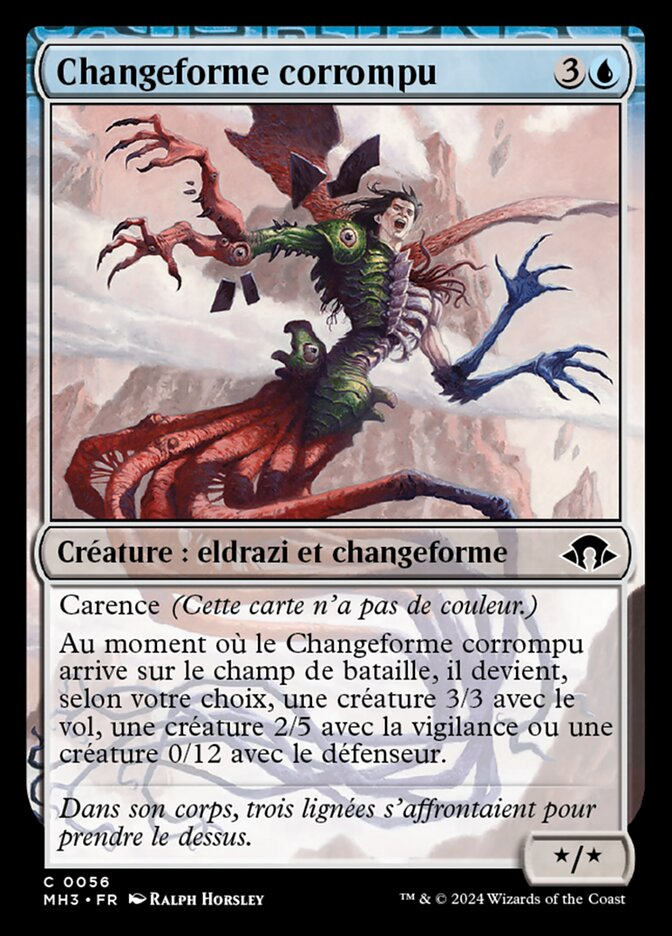

> 1. **zéro**, car sa capacité n'est pas une capacité de définition de caractéristique ([règle 604.3a.](https://yawgatog.com/resources/magic-rules/#R6043a))
> 2. **trois**, car c'est le premier choix imprimé sur la carte ([règle 604.3b.](https://yawgatog.com/resources/magic-rules/#R6043))
> 3. **ton choix parmi zéro, deux et trois**, car sa capacité est une capacité de définition de caractéristique à choix multiple ([règle 604.3a.](https://yawgatog.com/resources/magic-rules/#R6043a))
> 4. **zéro**, car c'est le dernier choix imprimé sur la carte ([règle 604.3c.](https://yawgatog.com/resources/magic-rules/#R6043))

----

## Correction : Question 9/20

**Réponse** : 1. **zéro**, sa capacité n'est pas une capacité de définition de caractéristique (CDC), comme expliqué dans la règle [règle 604.3a](https://yawgatog.com/resources/magic-rules/#R6043a).

En gros : elle dépend d'un choix à faire lors d'une arrivée sur le champ de bataille, donc n'est pas une CDC.

----

## Question 10/20 : estimation statistique

Combien d'exemplaires de la carte nommée **[Black Lotus](https://scryfall.com/card/lea/232/black-lotus)** ont été imprimés dans l'édition <i class="ss ss-lea ss-1x"></i> Alpha, à l'origine du jeu *Magic: the Gathering* en 1993 ?

 

> 1. *190*
> 2. *1100*
> 3. *25 000*
> 4. *360 000*

----

## Correction : Question 10/20

**Réponse** : 1100.

   
<!-- TODO: -->

> Désolé, je n'ai pas la source de cette réponse, je l'ai trouvée sur [un quiz fait par un collègue arbitre](https://docs.google.com/presentation/d/1q4SFKQiLnLsBcSz-pnwDnx9zoNQO9LVPhk-L-dWQ9L8/edit#slide=id.g2cb651add6c_4_32).

----

## Question 11/20 : connaissance sur le lore (dure)

Qu'est-ce qui a finalement ruiné la si belle journée de ce bon vieux **[Hans Ericksson](https://scryfall.com/card/cmr/279/fr/hans-eriksson)** ?

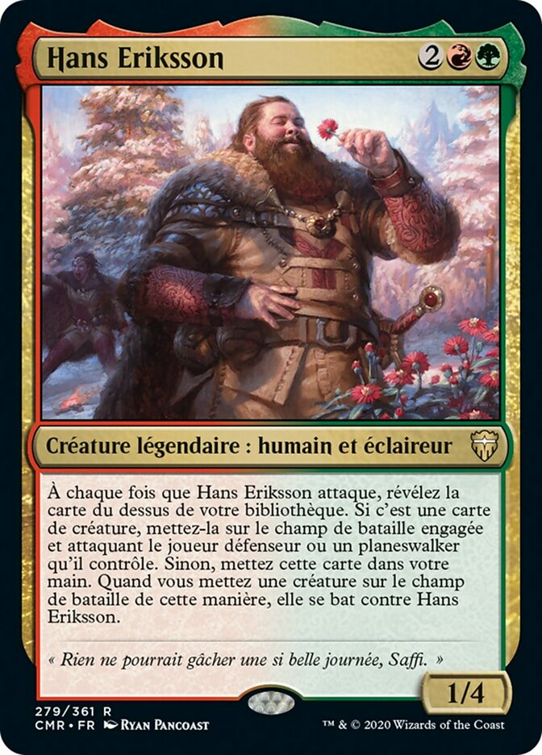

 

> 1. Une [**Patrouille gobeline à ski**](https://scryfall.com/card/ice/190/fr/patrouille-gobeline-%C3%A0-ski)
> 2. Une [**Chute de neige**](https://scryfall.com/card/ice/101/fr/chute-de-neige)
> 3. Le [**Lhurgoyf**](https://scryfall.com/card/m3c/235/fr/lhurgoyf)
> 4. Un [**Bonhomme de neige gobelin**](https://scryfall.com/card/ice/191/fr/bonhomme-de-neige-gobelin)

----

## Question 11/20 : connaissance sur le lore - Bonus (dure)

Donner le coût de mana de la carte que vous avez choisi.

 

1. [**Patrouille gobeline à ski**](https://scryfall.com/card/ice/190/fr/patrouille-gobeline-%C3%A0-ski)
2. [**Chute de neige**](https://scryfall.com/card/ice/101/fr/chute-de-neige)
3. [**Lhurgoyf**](https://scryfall.com/card/m3c/235/fr/lhurgoyf)
4. [**Bonhomme de neige gobelin**](https://scryfall.com/card/ice/191/fr/bonhomme-de-neige-gobelin)

----

## Correction : Question 11/20

Il s'agit de 3. Le **Lhurgoyf**, ce que l'on peut apprendre en lisant les textes d'ambiance de cette carte :

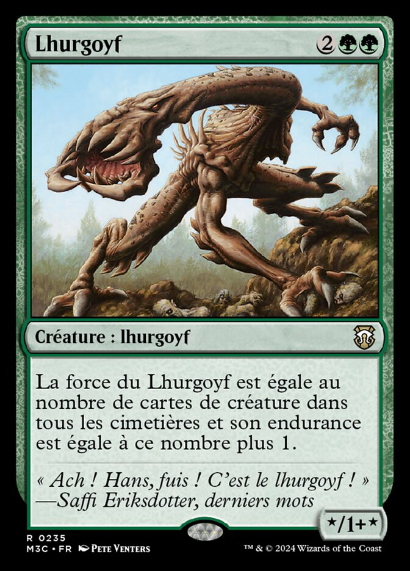

<!-- 1. [**Saffi Ericksdotter**](https://scryfall.com/card/tsr/260/saffi-eriksdotter) -->
<!-- 2. [**Lhurgoyf**](https://scryfall.com/card/m3c/235/fr/lhurgoyf) -->

  

> *« Ach ! Hans, fuis ! C'est le Lhurgoyf ! »* 
> *-- Saffi Eriksdotter, derniers mots*

  

<!-- ## Correction : Question 11/20 - Bonus -->

Le **Lhurgoyf** a comme coût de mana
<i class="mi mi-2 mi-mana mi-1x"></i>
<i class="mi mi-g mi-mana mi-1x"></i>
<i class="mi mi-g mi-mana mi-1x"></i>.

----

## Question 12/20 : connaissance des cartes

Oups, sa rareté a eté effacée... 
De quelle rareté est cette carte, le [**Biomathématicien**](https://scryfall.com/card/stx/164/fr/biomath%C3%A9maticien) ?

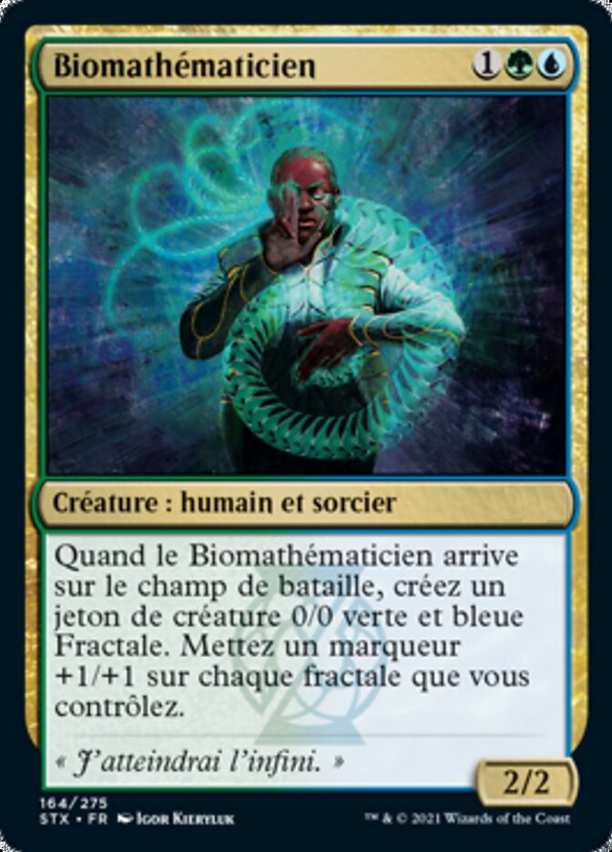

 

> 1. **Commune**
> 2. **Peu-commune**
> 3. **Rare**
> 4. **Rare mythique**

----

## Correction : Question 12/20

**Réponse** : 1. commune.

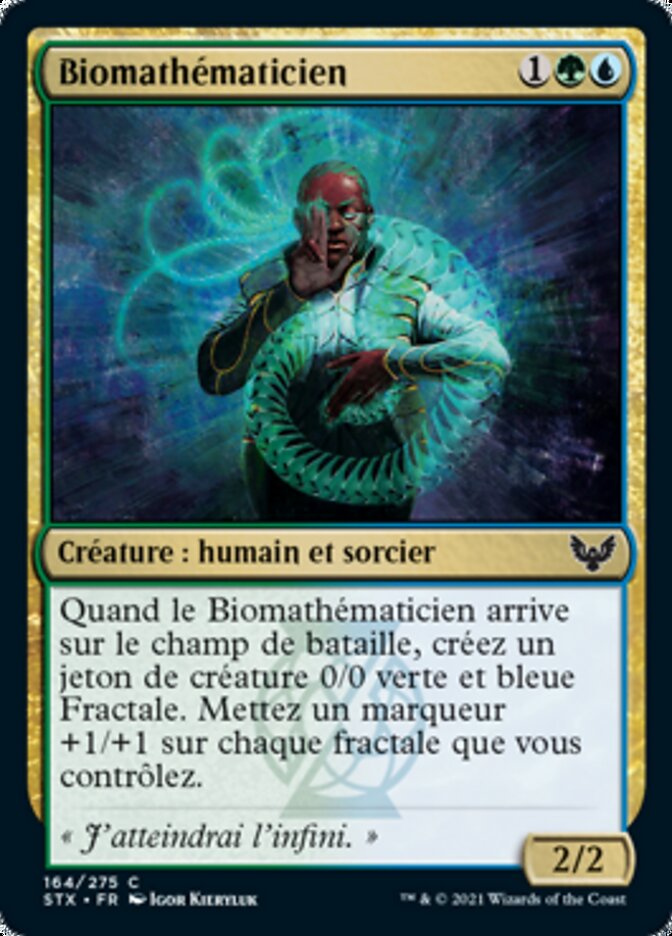

----

## Question 13/20 : connaissance des extensions *"Univers Étendus"*

Il y a quelques semaines, les premiers Secret Lairs **Magic / Marvel** sont sortis.

Lequel(s) de ces super héros n'a **<ins>pas</ins>** (encore ?) été annoncé(s) ? 
*Il faut avoir la bonne ou toutes les bonnes réponses.*

> 1. [**Tornade**](https://scryfall.com/card/sld/1742/storm-force-of-nature) (**Storm**)
> 2. [**Wolverine / Logan**](https://scryfall.com/card/sld/1737/wolverine-best-there-is)
> 3. [**Cyclope**](https://scryfall.com/)
> 4. [**Professeur X**](https://scryfall.com/) (**Charles Xavier**)

----

## Correction : Question 13/20

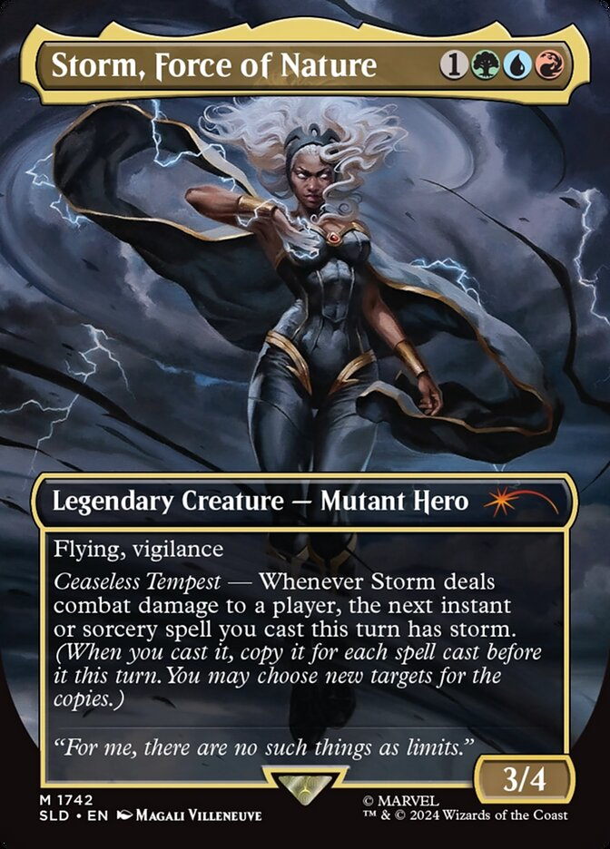
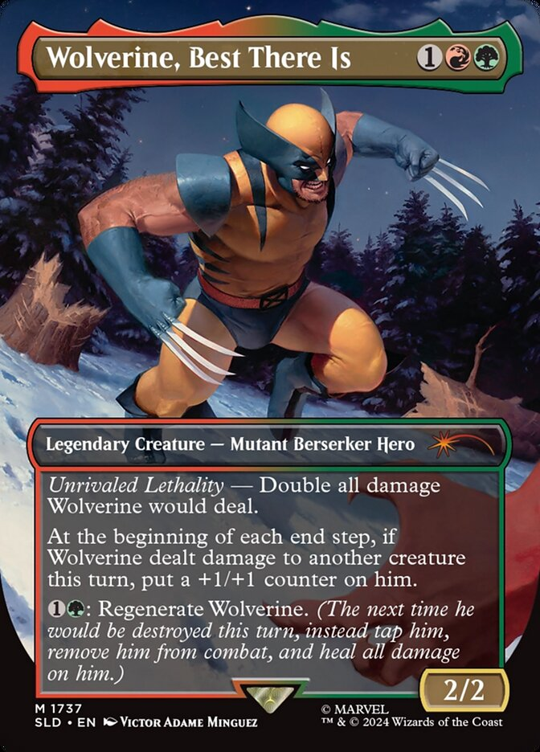

**Réponse** :

3. [**Cyclope**](https://scryfall.com/) et
4. [**Professeur X**](https://scryfall.com/) (**Charles Xavier**)

n'ont pas (encore ?) été annoncés.

<!-- TODO: vérifier que ce soit toujours correct ! -->

----

## Question 14/20 : connaissance sur le lore et les cartes

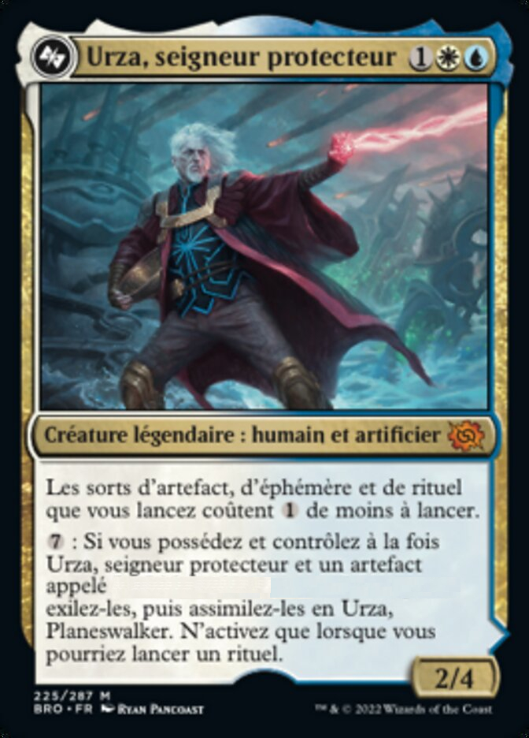
Comment s'appelle l'artefact légendaire qu'il faut contrôler, afin de pouvoir obtenir la surpuissante carte fusionnée [**Urza, Planeswalker**](https://scryfall.com/card/bro/238b/urza-planeswalker) ?

> 1. La [**Pierre de soumission**](https://scryfall.com/card/fbb/264/fr/pierre-de-soumission)
> 2. [**La Lithopuissance et la Lithorpeur**](https://scryfall.com/card/bro/238a/the-mightstone-and-weakstone)
> 3. [**La Lithoforce**](https://scryfall.com/card/mh3/298/fr/lithoforce-us%C3%A9e)
> 4. La [**Pierre de Guermont**](https://scryfall.com/card/afc/206/fr/pierre-de-guermont)

----

## Correction : Question 14/20

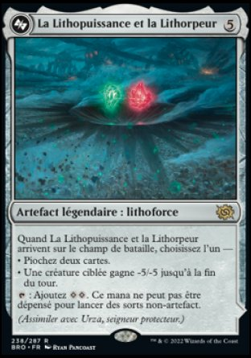

Il s'agit de 2. [**La Lithopuissance et la Lithorpeur**](https://scryfall.com/card/bro/238a/the-mightstone-and-weakstone), comme on peut le voir sur la vraie version de la carte que j'avais modifiée :

----

## Question 15/20 : connaissance sur les cartes et les règles

<!-- Si l'on joue avec 20 points de vie, seulement deux créatures peuvent prétendre pouvoir éliminer le joueur adverse en une seule attaque, sans aucun modificateur de leurs caractéristiques et avec aucun autre permanent sur le champ de bataille de son côté. -->
<!-- Quelles sont ces deux créatures ? Choisissez exactement deux réponses. -->
Parmi les cartes légales en Modern, seulement deux créatures peuvent éliminer un adversaire en une seule attaque. Lesquelles ?

 

> 1. [**Étali, mal primordial**](https://scryfall.com/card/mom/137/fr/etali-conqu%C3%A9rant-primordial-etali-mal-primordial)
> 2. [**Colosse de sombracier**](https://scryfall.com/card/fdn/671/darksteel-colossus)
> 3. [**Emrakul, Déchirure des Éons**](https://scryfall.com/card/2x2/1/fr/emrakul-d%C3%A9chirure-des-%C3%A9ons)
> 4. [**Colosse de pestacier**](https://scryfall.com/card/2xm/235/fr/colosse-de-pestacier)

----

## Correction : Question 15/20

**Réponse** : il s'agit des deux seules créatures ayant l'Infection et une force de 10 ou plus, à savoir [**Étali, mal primordial**](https://scryfall.com/card/mom/137/fr/etali-conqu%C3%A9rant-primordial-etali-mal-primordial) et [**Colosse de pestacier**](https://scryfall.com/card/2xm/235/fr/colosse-de-pestacier).
Les deux autres n'ont pas l'infection et ont une force de 11 pour le **Colosse de Sombracier**, et de 15 pour **Emrakul, Déchirure des Éons**.

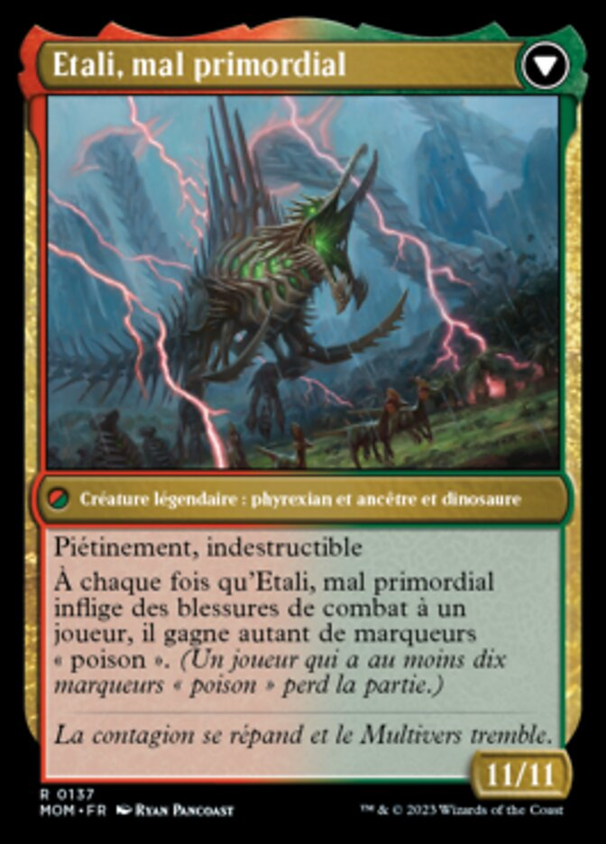
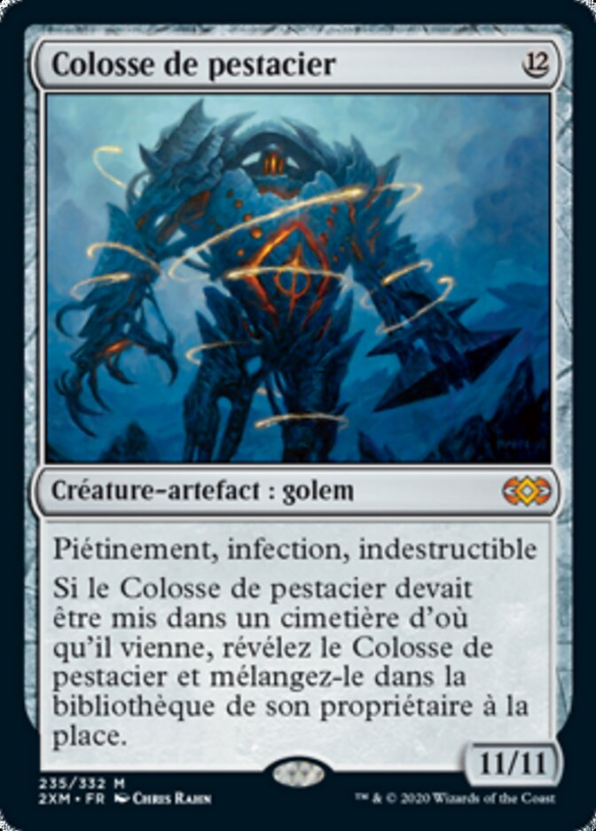

----

## Question 16/20 : connaissance des cartes, y compris les bords argentés (dure)

En considérant les cartes à bords argentés (les *"Un-set"*) et les jetons que celles-ci peuvent créer, combien de couleurs existent en tout dans Magic ?

 

> 1. **six** : cinq couleurs + l'incolore
> 2. **six** : cinq couleurs + le rose
> 3. **sept** : cinq couleurs + le rose + le doré
> 4. **autant que l'on veut**, car on peut nommer une *"couleur des yeux"* !

----

## Correction : Question 16/20

**Réponse** : 4. il y a bien sept couleurs précises : cinq couleurs, plus :

- le rose, avec [ce jeton Giant Teddy Bear 5/5](https://scryfall.com/card/tund/5/giant-teddy-bear) créé par le [**Water Gun Balloon Game**](https://scryfall.com/card/und/85/water-gun-balloon-game) ;
- le doré, avec [ce jeton Dragon 4/4 vol](https://scryfall.com/card/h17/4/dragon) créé par la [**Sword of Dungeons & Dragons**](https://scryfall.com/card/h17/3/sword-of-dungeons-&-dragons).

  > **Notes and Rules Information** for **Sword of Dungeons & Dragons**:
  > * The Dragon token is monocolored. It's gold. *(2018-01-19)*
  > * If asked to choose a color in a silver-bordered game, you can choose gold. *(2018-01-19)*

----

## Correction : Question 16/20

Mais, il faut aussi ajouter toutes les couleurs imaginables, car [**Avatar of Me**](https://scryfall.com/card/und/17/avatar-of-me) est de la couleur des yeux de son contrôleur...

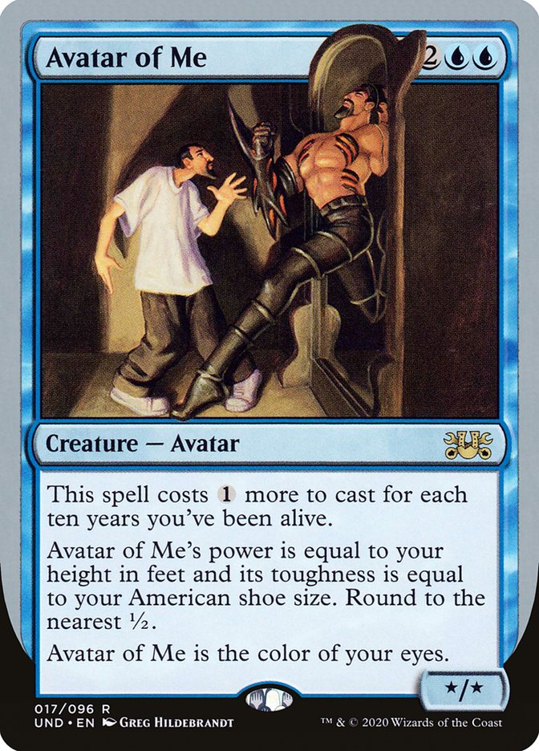

> **Notes and Rules Information** for **Avatar of Me**:
> Thanks to Avatar of Me, if you're asked to choose a color in a silver-bordered game, you can name any color. [...]

----

## Question 17/20 : connaissance du lore

Quel est plan du multivers a été le plus souvent visité par les extensions officielles de Magic, à ce jour ?

 

> 1. **Mirrodin**
> 2. **Innistrad**
> 3. **Ravnica**
> 4. **Dominaria**

----

## Correction : Question 17/20

**Réponse** : <u>Dominaria</u> : c'est assez évident si on connaît le début de Magic !
En effet, jusqu'au bloc Mirrodin sorti en 2003, presque tout se passait sur Dominaria !
Depuis, Dominaria est resté un bloc très visité.

----

## Question 18/20 : estimation statistique (dure)

Qui est l'artiste ayant illustré le plus de cartes différentes (versions papier) ?
**Bonus** : estimer pour combien de cartes ?

<small>
<em>En comptant toutes les variations, de cartes réellement imprimées, comme le ferait Scryfall en cherchant un/une artiste particulier.</em>

</small>

   

> 1. [*Dan Frazier*](https://scryfall.com/search?q=a%3A%E2%80%9CDan+Frazier%E2%80%9D+game%3Apaper&unique=prints&as=text&order=name)
> 2. [*John Avon*](https://scryfall.com/search?q=a%3A%E2%80%9CJohn+Avon%E2%80%9D+game%3Apaper&unique=prints&as=text&order=name)
> 3. [*Kev Walker*](https://scryfall.com/search?q=a%3A%E2%80%9CKev+Walker%E2%80%9D+game%3Apaper&unique=prints&as=text&order=name)
> 4. [*Greg Staples*](https://scryfall.com/search?q=a%3A%E2%80%9CGreg+Staples%E2%80%9D+game%3Apaper&unique=prints&as=text&order=name)

----

## Correction : Question 18/20

**Réponse** : 2. [John Avon](https://scryfall.com/search?q=a%3A%E2%80%9CJohn+Avon%E2%80%9D+game%3Apaper&unique=prints&as=text&order=name), avec actuellement 1306 cartes différentes (au 1er novembre 2024).

Les autres artistes ont, respectivement :

- 752 cartes pour [Dan Frazier](https://scryfall.com/search?q=a%3A%E2%80%9CDan+Frazier%E2%80%9D+game%3Apaper&unique=prints&as=text&order=name),
- 1196 cartes pour [Kev Walker](https://scryfall.com/search?q=a%3A%E2%80%9CKev+Walker%E2%80%9D+game%3Apaper&unique=prints&as=text&order=name),
- et 789 cartes pour [Greg Staples](https://scryfall.com/search?q=a%3A%E2%80%9CGreg+Staples%E2%80%9D+game%3Apaper&unique=prints&as=text&order=name).

----

## Question 19/20 : "œil de lynx" sur une carte *fun*

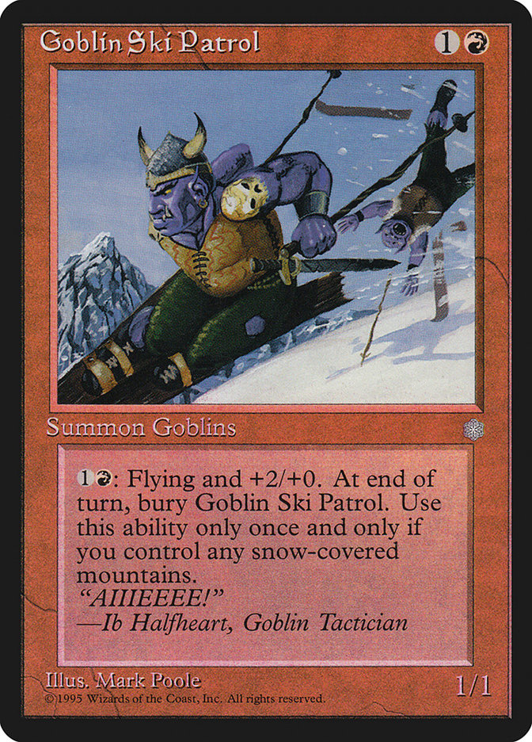
Comme un pro de <s>Photoshop</s> GIMP, j'ai modifié un petit détail sur cette carte, la [**Goblin Ski Patrol**](https://scryfall.com/card/ice/190/goblin-ski-patrol) datant d'Ice Age (1995)... Qu'ai-je modifié ?

> 1. L'illustration, j'ai ajouté des cornes !
> 2. Le coût de mana, en vrai c'est <i class="mi mi-4 mi-mana mi-1x"></i><i class="mi mi-mana mi-r mi-1x"></i>
> 3. L'illustration, j'ai enlevé la signature   de Mark Poole en bas à droite
> 4. Le nom du gobelin cité en texte d'ambiance...

----

## Correction : Question 19/20

**Réponse** : 3. **L'illustration**, j'ai enlevé la signature de Mark Poole.
<!-- Pas trop dur à faire avec GIMP, plutôt que Photoshop ! -->

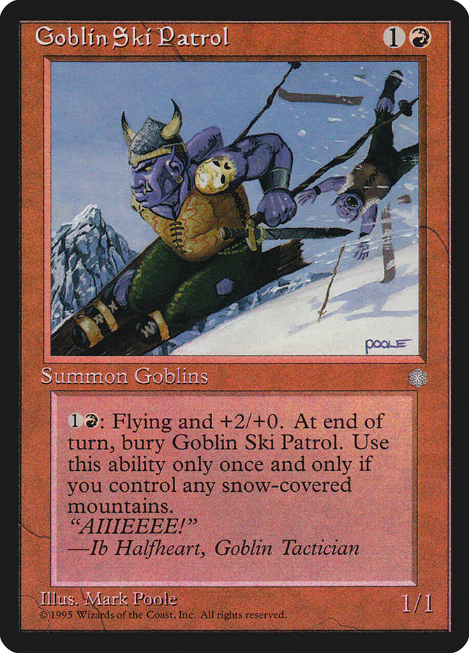

----

## Question 20/20 : connaissance des règles

<!-- https://rulesguru.org/?1177 -->
<!-- <i class="ms ms-loyalty-down ms-loyalty-1 ms-2x"></i> -->

Je contrôle [**Padeem, Consul de l'Innovation**](https://scryfall.com/card/kld/59/fr/padeem-consul-de-linnovation), ainsi qu'une [**Baliste ambulante**](https://scryfall.com/card/sld/1265/walking-ballista) ayant été lancée pour X valant un million (balèze !). 
Aucun autre permanent présent n'a atteint de valeur aussi impressionnante.

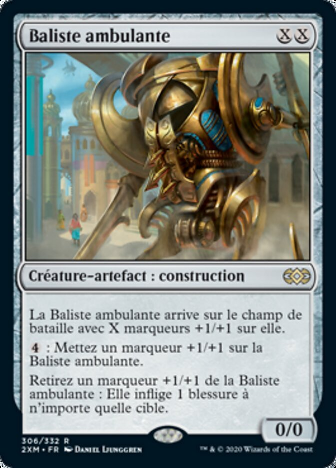 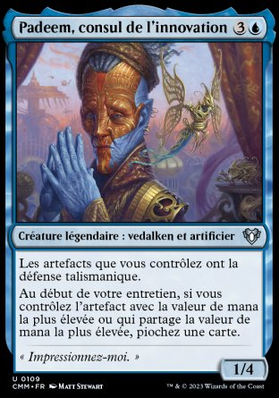

A mon entretien, suis-je **<ins>certain</ins>** de piocher, par la capacité de Padeem ?

> 1. **Oui**
> 2. **Non**

----

## Correction : Question 20/20

**Réponse** : Non, la Baliste a un coût de mana égal à zéro sur le champ de bataille.

----

<!--
## Question 21/20 : connaissance des cartes - Bonus pour départager, si besoin

Combien existe-t-il de créature(s), à bord noirs (pas de *"Un-Set"*), ayant une endurance imprimée de 0 (et pas *), ne recevant pas de marqueur +1/+1 lors de leur arrivée en jeu, n'ayant pas de capacité de définition de caractéristique, et n'ayant pas de capacité statique définissant ou augmentant son endurance ?

> 1. aucune (zéro)
> 2. une seule
> 3. deux
> 4. cinq

----

## Correction

Réponse : 2. une seule, il s'agit de [Force de Sauvagerie](https://scryfall.com/card/fut/126/force-of-savagery), une jolie créature 8/0 imprimée dans la très étrange extension Vision du Futur (Future Sight).

----
-->

## Question 21/20 : connaissance des cartes - Bonus pour départager, si besoin

Combien existe-t-il de cartes en tout, qui représentent les parents du plus mignon petit singe de tout Magic, [**Kibo, prince de l'Ouktabi**](https://scryfall.com/card/j22/40/fr/kibo-prince-de-louktabi) ?

> 1. aucune, **Kibo** n'existe pas et a été inventé pour cette question !
> 2. une seule, l'[**Orang-outang de l'Ouktabi**](https://scryfall.com/card/vis/123/uktabi-orangutan) de Visions (1996),
> 3. deux, avec aussi le [**Uktabi Kong**](https://scryfall.com/card/unh/115/uktabi-kong) à bords argentés,
> 4. trois, **Kibo** lui-même étant représenté avec ses parents.

----

## Correction : Question 21/20

Réponse : trois, **Kibo** lui-même étant représenté avec ses parents.

----

## Fin du Quiz !

  

### 🎉 Bravo à tous et toutes, merci de votre participation ! 🎉

 

### 🎁 Calcul des scores et distribution des lots ! 🎁

----

## A propos de ce *Quiz Magic*

<small>

- *Astuce* : utilisez "S" / "B" pour diminuer/augmenter la taille du texte ;
- Écrite en [Markdown](https://en.wikipedia.org/wiki/Markdown), un langage à balise léger et libre ;
- Convertie en slides web avec [`pandoc`](https://pandoc.org/), avec l'option "slidy" ;
- Utilise les polices spéciales *Magic the Gathering* : [Planewalker](https://www.cufonfonts.com/font/planewalker) pour le texte, [Keyrune](https://keyrune.andrewgioia.com/index.html) pour les symboles d'extension, [Alexandre Arpin's Font](http://alexandrearpin.com/mtg-font/icons.html) pour les autres symboles ; <!-- TODO: there is also this font, which includes Planeswalker symbols: https://mana.andrewgioia.com/icons.html -->
- Utilise la base de données `AllPrintings.sqlite` du projet [MTG JSON](https://mtgjson.com/downloads/all-files/#allprintings) pour vérifier certaines réponses ;
- Open-source et libre, [sur mon GitHub](https://github.com/Naereen/Un-Quiz-Magic-the-Gathering-pour-le-festival-Don-des-Dragons) ;
- [MIT Licensed](https://lbesson.mit-license.org/), (c) [Lilian Besson (Naereen), 2024](https://besson.link).

</small>
