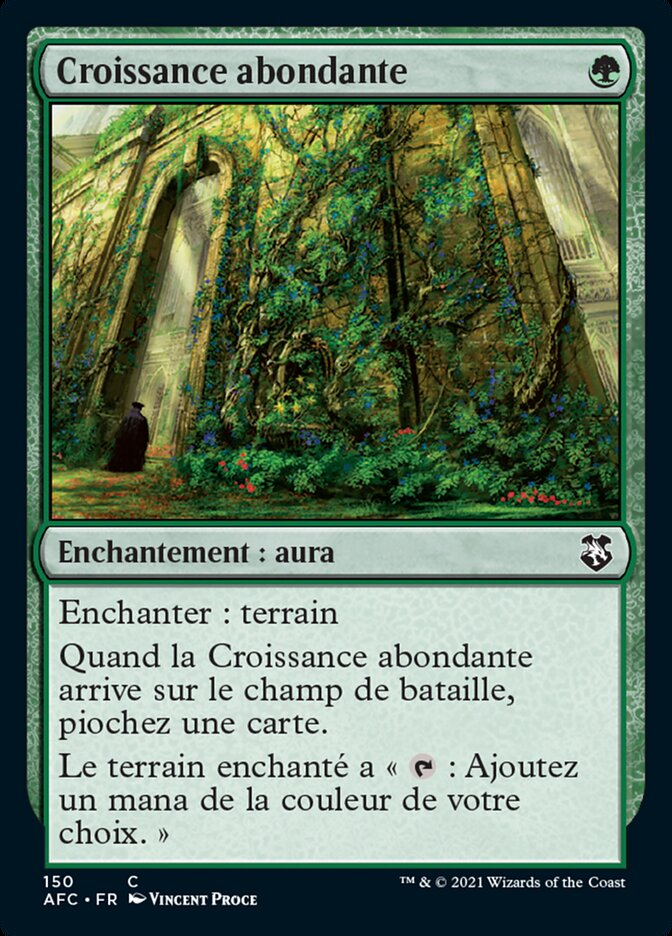
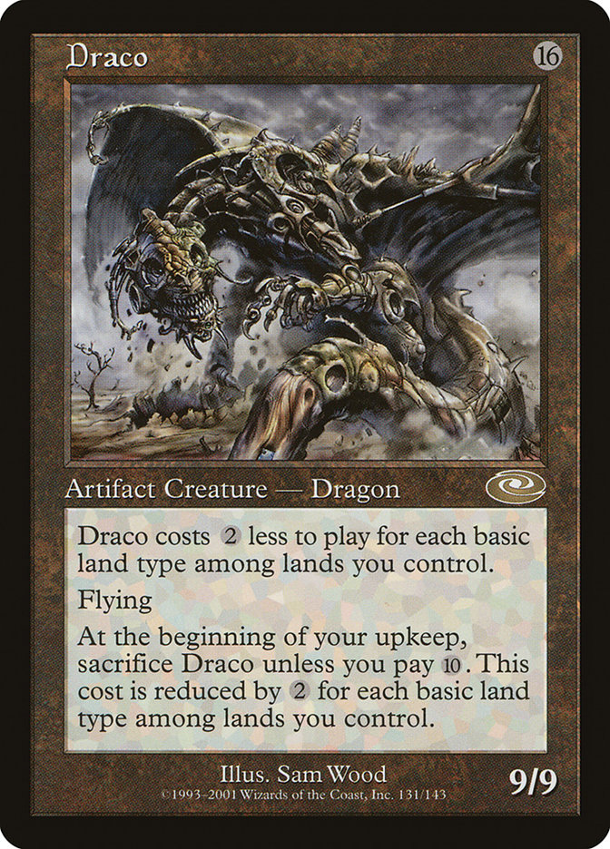
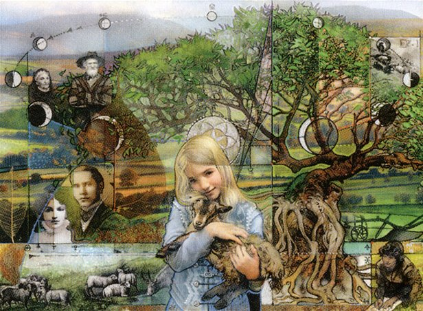
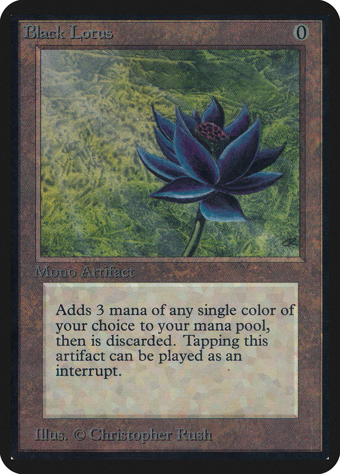
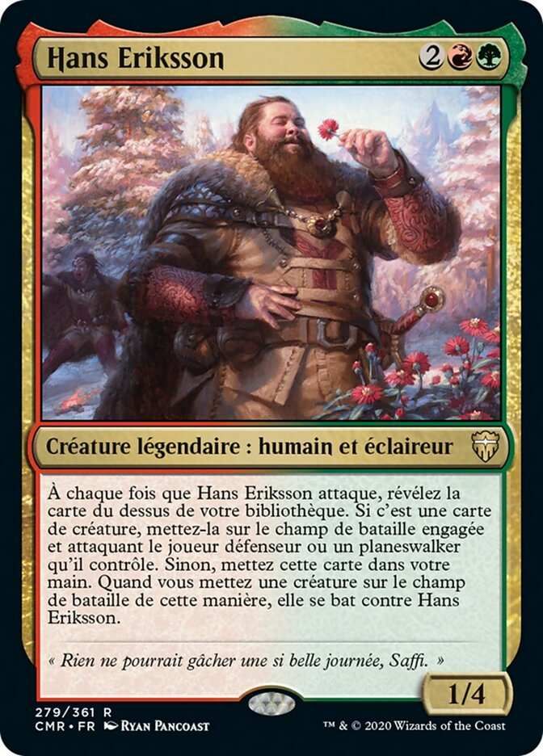
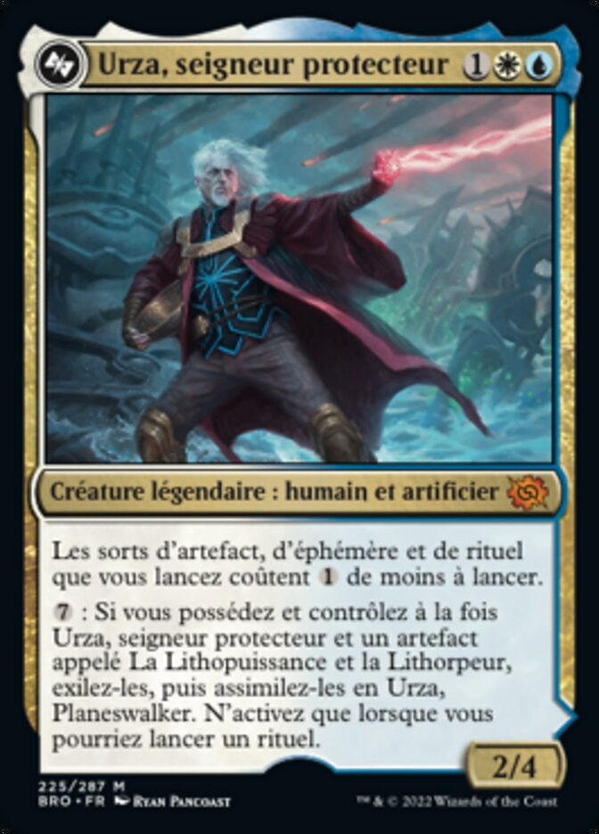
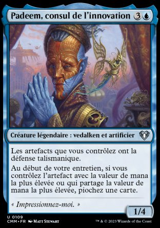

<link href="https://alexandrearpin.com/mtg-font/css/magic-font.css" rel="stylesheet" type="text/css" />
<link href="https://cdn.jsdelivr.net/npm/keyrune@latest/css/keyrune.css" rel="stylesheet" type="text/css" />

# Un Quiz sur *Magic: the Gathering*

Bienvenue dans ce quiz sur *Magic: the Gathering* <i class="mi mi-planeswalk mi-1x"></i>, notre jeu préféré !

. . .

Il y aura *20* questions, 5 fois de suite selon ce motif :

- 4 questions "plutôt faciles", en QCM à deux ou quatre choix,
  valant 1 point chacune,
- 1 question "plus dure", valant 2 points chacune,
  avec un bonus valant 1 point de plus !

. . .

Répondez sur vos ardoises, et à chaque question nous compterons les bonnes ou mauvaises réponses !

-----------------------------------

## Question 1/20 : connaissance de l'histoire du jeu (dure)

. . .

- Comment s'appelle l'extension ayant ce symbole ?

<!-- 
<i class="ss ss-sth ss-6x"></i>
 -->
<!-- 
<i class="ss ss-lgn ss-6x"></i>
 -->

<i class="ss ss-con ss-6x"></i>

- **Bonus** : *estimer* en quelle année elle est sortie ?

::: notes

<!-- **Réponse** : extension Forteresse (Stronghold, STH)
143 cards, sortie le 02 mars 1998 -->

<!-- **Réponse** : extension Légions (Legions, LGN)
145 cartes, sortie le 03 février 2003 -->

**Réponse** : extension Conflux (Conflux, CON)
145 cartes, sortie le 06 février 2009

:::

----

## Question 2/20 : estimation statistique sur les cartes

. . .

Quel type de créature est le **<ins>second</ins> le plus représenté** dans la couleur rouge <i class="mi mi-mana mi-r mi-shadow mi-1x"></i> ?

> 1. [Dragon](https://scryfall.com/search?q=id%3Dr+t%3Dcreature+game%3Dpaper+t%3Ddragon)
> 2. [Humain](https://scryfall.com/search?q=id%3Dr+t%3Dcreature+game%3Dpaper+t%3Dhuman)
> 3. [Gobelin](https://scryfall.com/search?q=id%3Dr+t%3Dcreature+game%3Dpaper+t%3Dgoblin)
> 4. [Guerrier](https://scryfall.com/search?q=id%3Dr+t%3Dcreature+game%3Dpaper+t%3Dwarrior)

::: notes

**Réponse** :

> 1. 148 dragons rouges
> 2. 497 humains rouges
> 3. 370 goblins rouges : c'est donc la bonne réponse (vérifiée en SQL avec [la base de données complète des cartes Magic the Gathering](https://mtgjson.com/downloads/all-files/#allprintings))
> 4. 339 guerriers rouges

:::

<!--
TODO: check the answer, using AllPrintings.sqlite and some well-written SQL code
See: https://mtgjson.com/downloads/all-files/#allprintings
-->

----

## Question 3/20 : connaissance du *lore*

. . .

Qui emprisonna [**Nicol Bolas**](https://scryfall.com/card/tsb/98/nicol-bolas) sur le plan de *Dominaria*,
avant sa libération lors des événements du [bloc Spirale Temporelle](https://scryfall.com/sets/tsp) ?

 

> 1. Son frère, [Ugin](https://scryfall.com/card/m3c/160/ugin-the-ineffable)
> 2. Un rival, [Arcades Sabboth](https://scryfall.com/card/dmr/355/arcades-sabboth)
> 3. Un héro antique, [Tetsuo Umezawa](https://scryfall.com/card/leg/262/tetsuo-umezawa)
> 4. Un arpenteur, [Urza](https://scryfall.com/card/bro/238b/urza-planeswalker)

::: notes

**Réponse** : Tetsuo Umezawa

:::

----

## Question 4/20 : connaissance des règles

. . .

Antoine enchante sa [**Cavernes aux gemmes**](https://scryfall.com/card/tsr/280/gemstone-caverns), qui a un marqueur "Chance", avec [**Croissance abondante**](https://scryfall.com/card/dmc/128/abundant-growth).
Au tour suivant, Nathan lance [**Mage de la lune**](https://scryfall.com/card/tsr/175/magus-of-the-moon).

. . .

Quelle(s) couleur(s) de mana les [**Cavernes aux gemmes**](https://scryfall.com/card/tsr/280/gemstone-caverns) pourront-elles désormais produire en s'engageant <i class="mi mi-tap mi-mana mi-1x"></i> ?

::: notes

**Réponse** : Any color. Magus of the Moon operates in the type-changing layer (613.1d) which is applied before the ability adding and removing layer. (613.1f) Gemstone Caverns is a Mountain, with the additional ability "<i class="mi mi-tap mi-mana mi-1x"></i> : Add one mana of any color.".

:::

----

## Question 5/20 : connaissance de l'histoire du jeu

. . .

Laquelle de ces éditions n'a **<ins>pas de carte à son nom</ins>** (VF ou VO) :

 

> 1. [Épopée d'Urza (USG)](https://scryfall.com/sets/usg)
> 2. [Chaos planaire (PLC)](https://scryfall.com/sets/plc)
> 3. [Visions de l'avenir (FUT)](https://scryfall.com/sets/fut)
> 4. [Destin reforgé (FRF)](https://scryfall.com/sets/frf)

::: notes

**Réponse** : Destin reforgé

> 1. <i class="ss ss-usg ss-1x"></i> Urza's Saga (usg) a [sa carte dans Modern Horizon 2 (MH2)](https://scryfall.com/card/mh2/259/urzas-saga)
> 2. <i class="ss ss-plc ss-1x"></i> Planar Chaos (plc) a [sa carte dans Jugement (JUD)](https://scryfall.com/card/jud/97/planar-chaos)
> 3. <i class="ss ss-fut ss-1x"></i> Future Sight (fut) a [sa carte dans Carnage (ONS)](https://scryfall.com/card/ons/84/future-sight)
> 4. **Réponse** : <i class="ss ss-frf ss-1x"></i> Destin reforgé (frf) n'a **pas** de carte a son nom.

:::

----

## Question 6/20 : sur le format Pauper (dure)

. . .

Laquelle de ces cartes communes n'est **<ins>pas légale</ins>** en Pauper ?

> 1. [Étude Rhystique (Rystic Study)](https://scryfall.com/card/pcy/45/fr/etude-rhystique)
> 2. [Hébétude (Daze)](https://scryfall.com/card/nem/30/fr/h%C3%A9b%C3%A9tude)
> 3. [Pétal de lotus (Lotus Petal)](https://scryfall.com/card/tmp/294/fr/p%C3%A9tale-de-lotus)
> 4. [Rémora mystique (Mystic Remora)](https://scryfall.com/card/ice/87/fr/r%C3%A9mora-mystique)

   

::: notes

**Réponse** : Hébétude (Daze)

Les quatre ont été éditées dans leur première édition à la rareté commune, mais Hébétude (Daze) est la seule à être **bannie en Pauper**.

:::

----

## Question 6/20 : sur le format Pauper - Bonus (dure)

   

**Bonus :** laquelle de ces quatre cartes a le prix moyen sur CardMarket.com le plus élevé ?
Dans sa version la moins chère, en VO en anglais (*"prix moyen"*, tel qu'affiché sur Scryfall hier soir).

<!-- **Bonus :** estimer le prix moyen sur CardMarket.com de votre réponse, dans sa version la moins chère, en VO en anglais (*"prix moyen"*, tel qu'affiché sur Scryfall hier soir). -->

::: notes

TODO: rafraîchir la réponse la veille du quiz !
**Réponse** : **1.85€** pour [la version la moins chère disponible (The List)](https://scryfall.com/card/plst/DD2-23/daze).

:::

----

## Question 7/20 : connaissance des cartes

. . .

Quel est le coût converti de mana le plus élevé imprimé à bords noirs (donc pas à bords argentés) ?

 

> 1. <i class="mi mi-13 mi-mana mi-1x"></i> (13)
> 2. <i class="mi mi-15 mi-mana mi-1x"></i> (15)
> 3. <i class="mi mi-16 mi-mana mi-1x"></i> (16)
> 4. <i class="mi mi-18 mi-mana mi-1x"></i> (18)

::: notes

La réponse est 16, avec la carte [Draco](https://scryfall.com/search?q=draco+cmc%3D16) de l'extension Planeshift sortie en 2001.

En comptant les cartes à bords argentés, il s'agit de [**Gleemax**](https://scryfall.com/card/unh/121/gleemax) qui a un coût de mana de 1.000.000 (un million de manas incolores).

:::

----

## Question 8/20 : sur une illustration très originale, que j'aime beaucoup

. . .

Qui est l'artiste ayant illustré la carte [**Chemin des descendants**](https://scryfall.com/card/avr/173/fr/chemin-des-descendants) de l'édition Avacyn Restored en 2012 ?

> 1. [**Rebecca Guay**](https://scryfall.com/search?q=a%3A%E2%80%9CRebecca+Guay%E2%80%9D&unique=art&as=grid&order=name)
> 2. [**Rob Alexander**](https://scryfall.com/search?q=a%3A%E2%80%9CRob+Alexander%E2%80%9D&unique=art&as=grid&order=name)
> 3. [**Terese Nielsen**](https://scryfall.com/search?q=a%3A%E2%80%9CTerese+Nielsen%E2%80%9D&unique=art&as=grid&order=name)
> 4. [**Aleksi Briclot**](https://scryfall.com/search?q=a%3A%E2%80%9CAleksi+Briclot%E2%80%9D&unique=art)

::: notes

**Réponse** : TODO:

:::

----

## Question 9/20 : connaissance des règles

. . .

Dans votre bibliothèque, quelle est la force de cet étrange [**Changeforme corrompu**](https://scryfall.com/card/mh3/56/fr/changeforme-corrompu) ?

> 1. zéro car sa capacité n'est pas une capacité de définition de caractéristique ([règle 604.3a.](https://yawgatog.com/resources/magic-rules/#R6043a))
> 2. trois car c'est le premier choix imprimé sur la carte ([règle 604.3b.](https://yawgatog.com/resources/magic-rules/#R6043))
> 3. votre choix parmi zéro, deux et trois, car sa capacité est une capacité de définition de caractéristique à choix multiple ([règle 604.3a.](https://yawgatog.com/resources/magic-rules/#R6043a))
> 4. zéro car c'est le dernier choix imprimé sur la carte ([règle 604.3c.](https://yawgatog.com/resources/magic-rules/#R6043))

::: notes

**Réponse** : 1. zéro, sa capacité n'est pas une capacité de définition de caractéristique, comme expliqué dans la règle [règle 604.3a.](https://yawgatog.com/resources/magic-rules/#R6043a).

:::

----

## Question 10/20 : estimation statistique sur les cartes

. . .

Combien d'exemplaires de la carte nommée **[Black Lotus](https://scryfall.com/card/lea/232/black-lotus)** ont été imprimés dans l'édition <i class="ss ss-lea ss-1x"></i> Alpha à l'origine du jeu *Magic: the Gathering* ?

 

> 1. *190*
> 2. *1100*
> 3. *25000*
> 4. *360000*

::: notes

**Réponse** : 1100.
TODO: Je n'ai pas la source de cette réponse, je l'ai trouvée sur [ce quiz fait par un collègue arbitre](https://docs.google.com/presentation/d/1q4SFKQiLnLsBcSz-pnwDnx9zoNQO9LVPhk-L-dWQ9L8/edit#slide=id.g2cb651add6c_4_32).

:::

----

## Question 11/20 : connaissance sur le lore (dure)

. . .

Qu'est-ce qui a finalement ruiné la si belle journée de ce bon vieux **[Hans Ericksson](https://scryfall.com/card/cmr/279/fr/hans-eriksson)** ?

 

> 1. Une [**Patrouille gobeline à ski**](https://scryfall.com/card/ice/190/fr/patrouille-gobeline-%C3%A0-ski)
> 2. Une [**Chute de neige**](https://scryfall.com/card/ice/101/fr/chute-de-neige)
> 3. Le [**Lhurgoyf**](https://scryfall.com/card/m3c/235/fr/lhurgoyf)
> 4. Un [**Bonhomme de neige gobelin**](https://scryfall.com/card/ice/191/fr/bonhomme-de-neige-gobelin)

::: notes

Il s'agit de 3. Le **Lhurgoyf**, ce que l'on peut apprendre en lisant les textes d'ambiance des cartes suivates :

1. [**Saffi Ericksdotter**](https://scryfall.com/card/tsr/260/saffi-eriksdotter)
2. [**Lhurgoyf**](https://scryfall.com/card/m3c/235/fr/lhurgoyf)

> *« Ach ! Hans, fuis ! C'est le Lhurgoyf ! »*
> *-- Saffi Eriksdotter, derniers mots*

:::

----

## Question 11/20 : connaissance sur le lore - Bonus (dure)

. . .

Donner le coût de mana de la carte que vous avez choisi.

 

1. [**Patrouille gobeline à ski**](https://scryfall.com/card/ice/190/fr/patrouille-gobeline-%C3%A0-ski)
2. [**Chute de neige**](https://scryfall.com/card/ice/101/fr/chute-de-neige)
3. [**Lhurgoyf**](https://scryfall.com/card/m3c/235/fr/lhurgoyf)
4. [**Bonhomme de neige gobelin**](https://scryfall.com/card/ice/191/fr/bonhomme-de-neige-gobelin)

----

## Question 12/20 : connaissance des cartes

. . .

Oups, sa rareté a eté effacée... De quelle rareté est cette carte, le [**Biomathématicien**](https://scryfall.com/card/stx/164/fr/biomath%C3%A9maticien) ?

 

> 1. **Commune**
> 2. **Peu-commune**
> 3. **Rare**
> 4. **Rare mythique**

::: notes

**Réponse** : 1. commune.

:::

----

## Question 13/20 : connaissance des cartes

. . .

Il y a quelques semaines, les futurs Secret Lairs **Magic / Marvel** ont été annoncés.

Lequel(s) de ces super héros n'a **<ins>pas</ins>** (encore ?) été annoncé(s) ?
*Il faut avoir la bonne ou toutes les bonnes réponses.*

> 1. [**Tornade**](https://scryfall.com/card/sld/1742/storm-force-of-nature) (**Storm**)
> 2. [**Wolverine / Logan**](https://scryfall.com/card/sld/1737/wolverine-best-there-is)
> 3. [**Cyclope**](https://scryfall.com/)
> 4. [**Professeur X**](https://scryfall.com/) (**Charles Xavier**)

::: notes

**Réponse** : 3. et 4. n'ont pas (encore ?) été annoncés.
TODO: vérifier que ce soit toujours correct !

:::

----

## Question 14/20 : connaissance sur le lore et les cartes

. . .

Comment s'appelle l'artefact légendaire qu'il faut contrôler, afin de pouvoir obtenir la surpuissante carte fusionnée [**Urza, Planeswalker**](https://scryfall.com/card/bro/238b/urza-planeswalker) ?

 

> 1. La [**Pierre de soumission**](https://scryfall.com/card/fbb/264/fr/pierre-de-soumission)
> 2. [**La Lithopuissance et la Lithorpeur**](https://scryfall.com/card/bro/238a/the-mightstone-and-weakstone)
> 3. [**La Lithoforce**](https://scryfall.com/card/mh3/298/fr/lithoforce-us%C3%A9e)
> 4. La [**Pierre de Guermont**](https://scryfall.com/card/afc/206/fr/pierre-de-guermont)

::: notes

Il s'agit de 2. [**La Lithopuissance et la Lithorpeur**](https://scryfall.com/card/bro/238a/the-mightstone-and-weakstone), comme on peut le voir sur la vraie version de la carte que j'avais modifiée :

:::

----

## Question 15/20 : connaissance sur les cartes et les règles

. . .

Si l'on joue avec 20 points de vie, seulement deux créatures peuvent prétendre pouvoir éliminer le joueur adverse en une seule attaque, sans aucun modificateur de leurs caractéristiques et avec aucun autre permanent sur le champ de bataille de son côté.
Quelles sont ces deux créatures ? Choisissez exactement deux réponses.

> 1. [**Étali, mal primordial**](https://scryfall.com/card/mom/137/fr/etali-conqu%C3%A9rant-primordial-etali-mal-primordial)
> 2. [**Colosse de sombracier**](https://scryfall.com/card/fdn/671/darksteel-colossus)
> 3. [**Emrakul, Déchirure des Éons**](https://scryfall.com/card/2x2/1/fr/emrakul-d%C3%A9chirure-des-%C3%A9ons)
> 4. [**Colosse de pestacier**](https://scryfall.com/card/2xm/235/fr/colosse-de-pestacier)

::: notes

**Réponse** : il s'agit des deux seules créatures ayant l'Infection et une force de 10 ou plus, à savoir [**Étali, mal primordial**](https://scryfall.com/card/mom/137/fr/etali-conqu%C3%A9rant-primordial-etali-mal-primordial) et [**Colosse de pestacier**](https://scryfall.com/card/2xm/235/fr/colosse-de-pestacier).
Les deux autres n'ont pas l'infection et ont une force de 11 pour le Colosse de Ssombrcier, et de 15 pour Emrakul, Déchirure des Éons.

:::

----

## Question 16/20 : connaissance des cartes, y compris les bords argentés (dure)

. . .

En considérant les cartes à bords argentés (Un-set) et les jetons que celles-ci peuvent créer, combien de couleurs existent en tout dans Magic ?

 

> 1. six : cinq couleurs + l'incolore
> 2. six : cinq couleurs + le rose
> 3. sept : cinq couleurs + le rose + le doré
> 4. autant que l'on veut, puisqu'on peut nommer *la couleur de ses yeux* !

::: notes

**Réponse** : 4. il y a bien sept couleurs précises : cinq couleurs, auxquelles s'ajoutent :

- le rose, avec [ce jeton Giant Teddy Bear 5/5](https://scryfall.com/card/tund/5/giant-teddy-bear) créé par le [**Water Gun Balloon Game**](https://scryfall.com/card/und/85/water-gun-balloon-game) ;
- le doré, avec [ce jeton Dragon 4/4 vol](https://scryfall.com/card/h17/4/dragon) créé par la [**Sword of Dungeons & Dragons**](https://scryfall.com/card/h17/3/sword-of-dungeons-&-dragons).

  > **Notes and Rules Information** for **Sword of Dungeons & Dragons**:
  > * The Dragon token is monocolored. It's gold. *(2018-01-19)*
  > * If asked to choose a color in a silver-bordered game, you can choose gold. *(2018-01-19)*

Mais, il faut aussi ajouter toutes les couleurs imaginables, car [**Avatar of Me**](https://scryfall.com/card/und/17/avatar-of-me) est de la couleur des yeux de son contrôleur...

> **Notes and Rules Information** for **Avatar of Me**:
> Thanks to Avatar of Me, if you're asked to choose a color in a silver-bordered game, you can name any color. [...]

:::

----

## Question 17/20 : connaissance du lore

. . .

Quel est plan du multivers a été le plus souvent visité par les extensions officielles de Magic, à ce jour ?

 

> 1. **Mirrodin**
> 2. **Innistrad**
> 3. **Ravnica**
> 4. **Dominaria**

::: notes

**Réponse** : Dominaria, sans avoir besoin de justifier... C'est évident si on connaît le début de Magic.

:::

----

## Question 18/20 : estimation statistique (dure)

. . .

Qui est l'artiste ayant illustré le plus de cartes différentes ?
 **Bonus** : estimer pour combien de cartes ?

<small>
<em>En comptant toutes les variations, de cartes réellement imprimées, comme le ferait Scryfall en cherchant un artiste particulier.</em>

</small>

   

> 1. [*Dan Frazier*](https://scryfall.com/search?q=a%3A%E2%80%9CDan+Frazier%E2%80%9D+game%3Apaper&unique=prints&as=text&order=name)
> 2. [*John Avon*](https://scryfall.com/search?q=a%3A%E2%80%9CJohn+Avon%E2%80%9D+game%3Apaper&unique=prints&as=text&order=name)
> 3. [*Kev Walker*](https://scryfall.com/search?q=a%3A%E2%80%9CKev+Walker%E2%80%9D+game%3Apaper&unique=prints&as=text&order=name)
> 4. [*Greg Staples*](https://scryfall.com/search?q=a%3A%E2%80%9CGreg+Staples%E2%80%9D+game%3Apaper&unique=prints&as=text&order=name)

::: notes

**Réponse** : 2. [John Avon](https://scryfall.com/search?q=a%3A%E2%80%9CJohn+Avon%E2%80%9D+game%3Apaper&unique=prints&as=text&order=name), avec actuellement 1306 cartes différentes (au 1er novembre 2024).

Les autres artistes ont, respectivement, 752 cartes pour [Dan Frazier](https://scryfall.com/search?q=a%3A%E2%80%9CDan+Frazier%E2%80%9D+game%3Apaper&unique=prints&as=text&order=name), 1196 cartes pour [Kev Walker](https://scryfall.com/search?q=a%3A%E2%80%9CKev+Walker%E2%80%9D+game%3Apaper&unique=prints&as=text&order=name), et 789 cartes pour [Greg Staples](https://scryfall.com/search?q=a%3A%E2%80%9CGreg+Staples%E2%80%9D+game%3Apaper&unique=prints&as=text&order=name).

:::

----

## Question 19/20 : "œil de lynx" sur une carte *fun*

. . .

Comme un pro de <s>Photoshop</s> GIMP, j'ai modifié un petit détail sur cette carte, la [**Goblin Ski Patrol**](https://scryfall.com/card/ice/190/goblin-ski-patrol) datant d'Ice Age (1995)... Qu'ai-je modifié ?

> 1. L'illustration, j'ai ajouté des cornes !
> 2. Le coût de mana, en vrai c'est <i class="mi mi-4 mi-mana mi-shadow mi-1x"></i><i class="mi mi-mana mi-r mi-shadow mi-1x"></i> (autre époque, hein ?)
> 3. L'illustration, j'ai enlevé la signature de Mark Poole en bas à droite
> 4. Le nom du gobelin cité en texte d'ambiance...

::: notes

**Réponse** : 3. L'illustration, j'ai enlevé la signature de Mark Poole. Pas trop dur à faire avec GIMP, plutôt que Photoshop !

:::

----

## Question 20/20 : connaissance des règles

. . .

<!-- https://rulesguru.org/?1177 -->
<!-- <i class="ms ms-loyalty-down ms-loyalty-1 ms-2x"></i> -->

Je contrôle [**Padeem, Consul de l'Innovation**](https://scryfall.com/card/kld/59/fr/padeem-consul-de-linnovation), ainsi qu'une [**Baliste ambulante**](https://scryfall.com/card/sld/1265/walking-ballista) ayant été lancée pour X valant un million (balèze !). 
Aucun autre permanent présent n'a atteint de valeur aussi impressionnante.

 

A mon entretien, suis-je **<ins>certain</ins>** de piocher, par la capacité de Padeem ?

> 1. **Oui**
> 2. **Non**

::: notes

**Réponse** : Non, la Baliste a un coût de mana égal à zéro sur le champ de bataille.

:::

----

## Question 21/20 connaissance des cartes

. . .

<!-- TODO: move to Q21 ? -->

Combien existe-t-il de créature(s), imprimées sur une carte à bord noirs, ayant une endurance imprimée de 0 (et pas *), ne recevant pas de marqueur +1/+1 lors de leur arrivée en jeu, n'ayant pas de capacité de définition de caractéristique, et n'ayant pas de capacité statique définissant ou augmentant son endurance ?

> 1. aucune (zéro)
> 2. une seule
> 3. deux
> 4. cinq

::: notes

Réponse : 2. une seule, il s'agit de [Force de Sauvagerie](https://scryfall.com/card/fut/126/force-of-savagery), une jolie créature 8/0 imprimée dans la très étrange extension Vision du Futur (Future Sight).

:::

----

## Fin du Quiz !

  

### 🎉 Bravo à tous et toutes, merci de votre participation ! 🎉

 

### 🎁 Calcul des scores et distribution des lots ! 🎁

----

## A propos de cette présentation

<small>

- *Astuce* : utilisez "S" / "B" pour diminuer/augmenter la taille du texte ;
- Écrite en [Markdown](https://en.wikipedia.org/wiki/Markdown), un langage à balise léger et libre ;
- Convertie en slides web avec [`pandoc`](https://pandoc.org/), avec l'option "slidy" ;
- Utilise les polices spéciales *Magic the Gathering* : [Planewalker](https://www.cufonfonts.com/font/planewalker) pour le texte, [Keyrune](https://keyrune.andrewgioia.com/index.html) pour les symboles d'extension, [Alexandre Arpin's Font](http://alexandrearpin.com/mtg-font/icons.html) pour les autres symboles ; <!-- TODO: there is also this font, which includes Planeswalker symbols: https://mana.andrewgioia.com/icons.html -->
- Utilise la base de données `AllPrintings.sqlite` du projet [MTG JSON](https://mtgjson.com/downloads/all-files/#allprintings) pour vérifier certaines réponses ;
- Open-source et libre, [sur mon GitHub](https://github.com/Naereen/Un-Quiz-Magic-the-Gathering-pour-le-festival-Don-des-Dragons) ;
- [MIT Licensed](https://lbesson.mit-license.org/), (c) [Lilian Besson (Naereen), 2024](https://besson.link).

</small>
