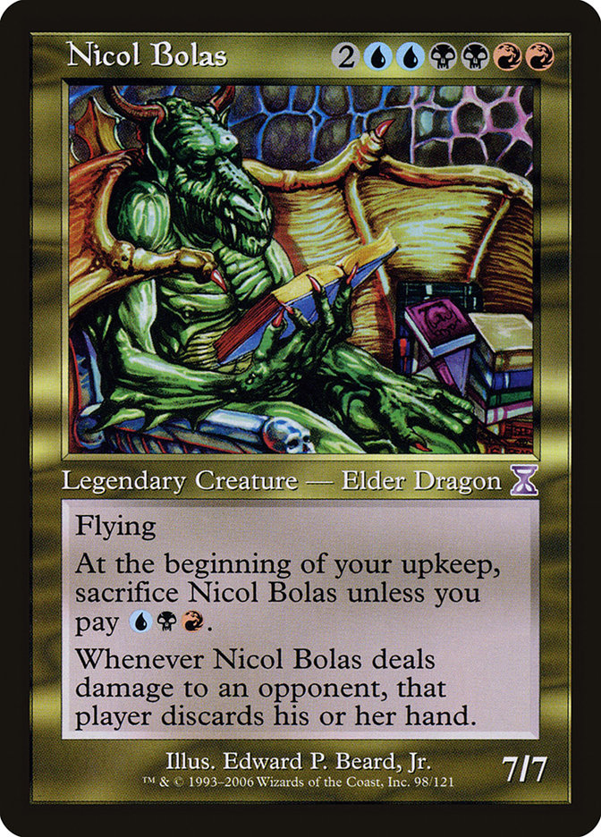
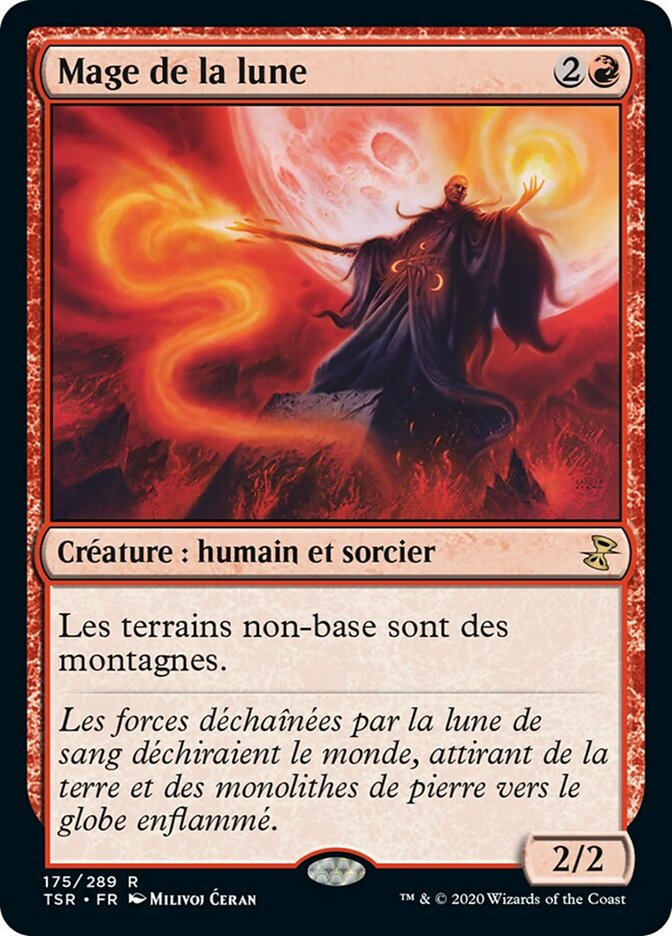
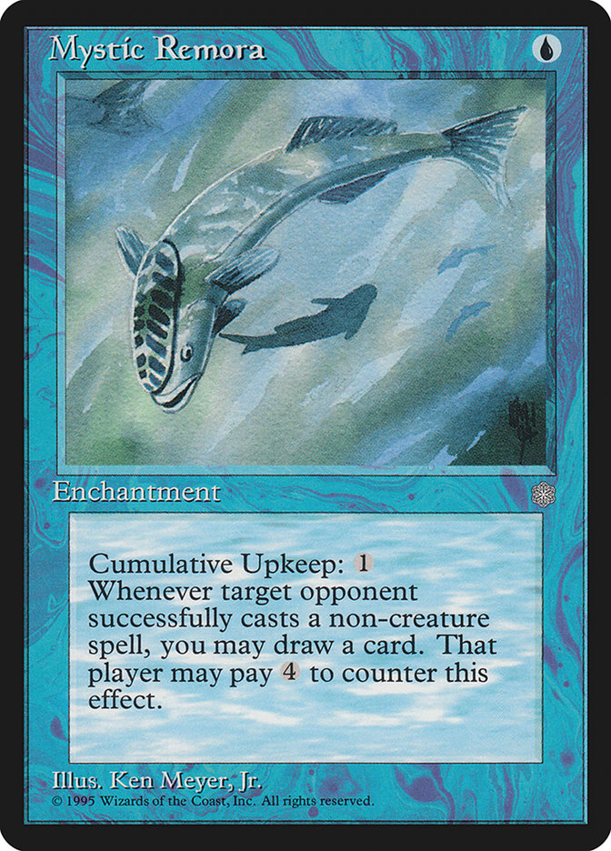

<link href="https://alexandrearpin.com/mtg-font/css/magic-font.css" rel="stylesheet" type="text/css" />
<link href="https://cdn.jsdelivr.net/npm/keyrune@latest/css/keyrune.css" rel="stylesheet" type="text/css" />

# Un Quiz sur *Magic: the Gathering*

Bienvenue dans ce quiz sur *Magic: the Gathering* <i class="mi mi-planeswalk mi-1x"></i>, notre jeu préféré !

Il y aura *20* questions, 5 fois de suite selon ce motif :

- 4 questions "plutôt faciles", en QCM à quatre choix,
  valant 1 point chacune,
- 1 question "plus dure" en réponse libre,
  valant 2 points chacune,
  avec un bonus valant 1 point de plus !

Répondez sur vos ardoises, et à chaque question nous compterons les bonnes ou mauvaises réponses !

-----------------------------------

## Question 1/20 : connaissance de l'histoire du jeu (dure)

. . .

- Comment s'appelle l'extension ayant ce symbole ?

<i class="ss ss-sth ss-6x"></i>

- **Bonus** : *estimer* en quelle année elle est sortie ?

::: notes

**Réponse** : extension Forteresse (Stronghold)
Stronghold (STH)
143 cards, sortie le 02 mars 1998

:::

----

## Question 2/20 : estimation statistique sur les cartes

. . .

Quel type de créature est le **<ins>second</ins> le plus représenté** dans la couleur rouge <i class="mi mi-mana mi-r mi-shadow mi-1x"></i> ?

 

> 1. [Dragon](https://scryfall.com/search?q=id%3Dr+t%3Dcreature+game%3Dpaper+t%3Ddragon)
> 2. [Humain](https://scryfall.com/search?q=id%3Dr+t%3Dcreature+game%3Dpaper+t%3Dhuman)
> 3. [Gobelin](https://scryfall.com/search?q=id%3Dr+t%3Dcreature+game%3Dpaper+t%3Dgoblin)
> 4. [Guerrier](https://scryfall.com/search?q=id%3Dr+t%3Dcreature+game%3Dpaper+t%3Dwarrior)

::: notes

**Réponse** :

> 1. 148 dragons rouges
> 2. 497 humains rouges
> 3. 370 goblins rouges : c'est donc la bonne réponse (vérifiée en SQL avec [la base de données complète des cartes Magic the Gathering](https://mtgjson.com/downloads/all-files/#allprintings))
> 4. 339 guerriers rouges

:::

<!--
TODO: check the answer, using AllPrintings.sqlite and some well-written SQL code
See: https://mtgjson.com/downloads/all-files/#allprintings
-->

----

## Question 3/20 : connaissance du *lore*

. . .

Qui emprisonna **Nicol Bolas** sur le plan de *Dominaria*,
avant sa libération lors des événements du [bloc Spirale Temporelle](https://scryfall.com/sets/tsp) ?

 

> 1. [Ugin](https://scryfall.com/card/m3c/160/ugin-the-ineffable)
> 2. [Arcades Sabboth](https://scryfall.com/card/dmr/355/arcades-sabboth)
> 3. [Tetsuo Umezawa](https://scryfall.com/card/leg/262/tetsuo-umezawa)
> 4. [Urza](https://scryfall.com/card/bro/238b/urza-planeswalker)

::: notes

**Réponse** : Tetsuo Umezawa

:::

----

## Question 4/20 : connaissance des règles

. . .

Antoine enchante sa **Cavernes aux gemmes** avec **Croissance abondante**.  
Au tour suivant, Nathan lance **Mage de la lune**.

. . .

Quelle(s) couleur(s) de mana les **Cavernes aux gemmes** pourront-elles désormais produire en s'engageant <i class="mi mi-tap mi-mana mi-1x"></i> ?

::: notes

**Réponse** : Any color. Magus of the Moon operates in the type-changing layer (613.1d) which is applied before the ability adding and removing layer. (613.1f) Gemstone Caverns is a Mountain, with the additional ability "<i class="mi mi-tap mi-mana mi-1x"></i> : Add one mana of any color.".

:::

----

## Question 5/20 : connaissance de l'histoire du jeu

. . .

Laquelle de ces éditions n'a **<ins>pas de carte ayant le même nom</ins>** (VF ou VO) :

 

> 1. [Épopée d'Urza (USG)](https://scryfall.com/sets/usg)
> 2. [Chaos planaire (PLC)](https://scryfall.com/sets/plc)
> 3. [Visions de l'avenir (FUT)](https://scryfall.com/sets/fut)
> 4. [Destin reforgé (FRF)](https://scryfall.com/sets/frf)

::: notes

**Réponse** : Destin reforgé

> 1. <i class="ss ss-usg ss-1x"></i> Urza's Saga (usg) a [sa carte dans Modern Horizon 2 (MH2)](https://scryfall.com/card/mh2/259/urzas-saga)
> 2. <i class="ss ss-plc ss-1x"></i> Planar Chaos (plc) a [sa carte dans Jugement (JUD)](https://scryfall.com/card/jud/97/planar-chaos)
> 3. <i class="ss ss-fut ss-1x"></i> Future Sight (fut) a [sa carte dans Carnage (ONS)](https://scryfall.com/card/ons/84/future-sight)
> 4. **Réponse** : <i class="ss ss-frf ss-1x"></i> Destin reforgé (frf) n'a **pas** de carte a son nom.

:::

----

## Question 6/20 : sur le format Pauper (dure)

. . .

Laquelle de ces cartes n'est **<ins>pas légale</ins>** en Pauper ?

> 1. [Étude Rhystique (Rystic Study)](https://scryfall.com/card/pcy/45/fr/etude-rhystique)
> 2. [Hébétude (Daze)](https://scryfall.com/card/nem/30/fr/h%C3%A9b%C3%A9tude)
> 3. [Pétal de lotus (Lotus Petal)](https://scryfall.com/card/tmp/294/fr/p%C3%A9tale-de-lotus)
> 4. [Rémora mystique (Mystic Remora)](https://scryfall.com/card/ice/87/fr/r%C3%A9mora-mystique)

   

::: notes

**Réponse** : Hébétude (Daze)

Les quatre ont été éditées dans leur première édition à la rareté commune, mais Hébétude (Daze) est bannie en Pauper.

:::

----

## Question 6/20 : sur le format Pauper - Bonus (dure)

   

**Bonus :** estimer le prix CardMarket moyen de votre réponse, dans leur version la moins chère, en VO en anglais (*"prix moyen"*, tel qu'affiché sur Scryfall hier soir).

----

## Fin du Quiz !

🎉 Bravo à tous et toutes, merci de votre participation ! 🎉

. . .

### Calcul des scores et distribution des lots !

----

## A propos de cette présentation

- Écrite en [Markdown](https://en.wikipedia.org/wiki/Markdown) ;
- Convertie en slides web avec [`pandoc`](https://pandoc.org/), avec l'option "slidy" ;
- Utilisez "S" / "B" pour diminer/augmenter la taille du texte ;
- Utilise les polices spéciales *Magic the Gathering* : [Planewalker](https://www.cufonfonts.com/font/planewalker) pour le texte, [Keyrune](https://keyrune.andrewgioia.com/index.html) pour les symboles d'extension, [Alexandre Arpin's Font](http://alexandrearpin.com/mtg-font/icons.html) pour les autres symboles ;
- Open-source et libre, [sur mon GitHub](https://github.com/Naereen/Un-Quiz-Magic-the-Gathering-pour-le-festival-Don-des-Dragons)
- [MIT Licensed](https://lbesson.mit-license.org/), (c) [Lilian Besson (Naereen), 2024](https://besson.link)
